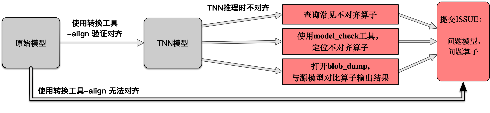

# 模型对齐常见问题

[English Version](../en/model_align_en.md)

在使用转换得到的TNN模型进行推理时，有时会遇到TNN模型的推理结果与原始模型不对齐的情况。此文档总结了模型不对齐问题的主要原因、常见的不对齐算子以及分析和处理不对齐问题的方法。模型不对齐问题的整体处理流程可参考下图。

<div>

## 一、模型对齐的验证与检查

### 1. 模型转换时使用-align检查对齐情况

TNN模型转换工具支持对齐功能，可以在模型转换时检查生成的TNN模型与源模型是否对齐。强烈建议在模型转换时打开对齐检查，具体文档请参考[模型转换文档](https://github.com/Tencent/TNN/blob/master/doc/cn/user/convert.md)。

### 2. 使用model_check工具检查对齐情况

对于已经转换完成的模型，TNN提供了**model_check**工具辅助模型对齐情况的验证。**model_check**工具主要用于比较TNN不同设备(例如ARM，OpenCL，Metal等)的执行结果是否与TNN CPU等价，当怀疑TNN在某些设备上的执行结果不正确时，可以使用此工具进行检查。

**model_check**工具可以方便地在指定设备上，使用给出的输入数据或随机生成数据执行TNN模型，并与TNN CPU的执行结果进行逐算子的比较，从而准确定位存在问题的算子。**model_check**的使用方法请参考[model_check文档](https://github.com/Tencent/TNN/blob/master/doc/cn/development/model_check.md)。

## 二、常见的模型对齐问题

如果模型转换工具成功生成了TNN模型，但在使用中发现了不对齐的情况，可以按照以下方法排查问题。

由于神经网络模型类型众多，且不同框架对算子的定义和支持不尽相同，再加之各框架的算子支持情况还会随版本变化，所以存在转换前后算子功能不完全等价的情况。下表按照源模型的类型，总结了在实践中遇到的可能存在对齐问题的算子，可用于快速定位可能存在对齐问题的算子。

|源模型|问题算子列表|
|-|-|
|Pytorch    |upsample, batchnorm, AvgPool|
|TensorFlow |TODO|
|tflite     |ResizeBilinear|
|onnx       |TODO|

### 1.tensorflow
TODO

### 2.pytorch

#### upsample 

问题描述：将pytorch模型转换为onnx模型时，onnx的upsample算子与pytorch不等价

解决方法：1）更新pytorch；2）导出onnx模型时，设置opset_version>=11，代码如下：
```
torch.onnx.export(model, input, filename, verbose=False,
                  opset_version=11,...) # or other number greater than 11
```

#### batchnorm

问题描述：将pytorch模型转换为onnx模型时，没有将pytorch切换到推理模式，导致batchnorm参数不固定

解决方法：导出onnx模型前，切换pytorch到推理模式，代码如下：
```torch_model.eval()``` or ```torch_model.train(False)```

#### AvgPool

问题描述：pytorch模型中的AvgPool算子有count_include_pad属性，取值可以为```True```或```False```，当前TNN仅支持count_include_pad=```Fasle```的情况。

解决方法：导出onnx模型前，修改AvgPool算子的count_include_pad为```False```


### 3.tflite

#### ResizeBilinear

问题描述：含有ResizeBilinear的tflite模型使用-align可能会不对齐，这是由于TensorFlow2.3之前tflite的ResizeBilinear实现存在问题导致的

解决方法：升级TensorFlow让其版本不小于2.3即可

### 4.onnx
TODO

## 三、模型对齐问题的分析与处理方法

在排查模型对齐问题时，最直接有效的方法就是对比模型在相同输入下的计算结果。这一过程需要将TNN模型中特定算子的计算结果与原始模型中对应算子的计算结果进行比较。这可以通过保存算子的输入与输出实现。

TNN支持逐层dump结果的功能，可以通过下面的方法获得每层的输入和输出结果。

### 1. 打开blob dump功能

打开[source/tnn/utils/blob_dump_utils.h](https://github.com/Tencent/TNN/blob/master/source/tnn/utils/blob_dump_utils.h)文件，根据需要修改`DUMP_INPUT_BLOB`和`DUMP_OUTPUT_BLOB`两个宏。其中`DUMP_INPUT_BLOB`为`1`表示保存TNN模型每个算子的输入;设置`DUMP_OUTPUT_BLOB`为`1`表示保存每个算子的输出。

数据保存过程的调用在[source/tnn/core/default_network.cc](https://github.com/Tencent/TNN/blob/master/source/tnn/core/default_network.cc)的`Forward`方法中。

具体来说，TNN将算子的每个输入和输出保存在独立的txt文本文件中，文件名由**算子在模型中的顺序、算子名称以及输入和输出自身的形状等因素共同**决定。例如，假设模型的第2层名为*foo*，其第1个输入被保存在前缀为*00001-foo-in-0*的文件中；其第2个输出被保存在前缀为*00001-foo-out-1*的文件中。每层的计算结果按照*N-C-H-W*的顺序保存在文件内，每行保存一个元素。TNN模型各算子的输入输出信息可借助[**Netron**可视化工具](https://netron.app/)查看。

文件的保存目录由[source/tnn/utils/blob_dump_utils.cc](https://github.com/Tencent/TNN/blob/master/source/tnn/utils/blob_dump_utils.cc)中的变量 `g_tnn_dump_directory`控制，可以根据需要进行修改。

### 2. 使用指定输入，获得每层计算结果

考虑到保存数据的过程位于`Forward`方法中，我们可以通过调用`Forward`方法实现数据保存。此外，也可以借助TNN已有的工具执行这一过程，例如**TNNTest**工具。由于**TNNTest**默认使用异步方法执行推理，不调用`Forward`方法，所以需要进行修改。

具体修改方法如下：打开[test/test.cc](https://github.com/Tencent/TNN/blob/master/test/test.cc)文件，找到其中的`ForwardAsync`方法，并将其替换为`Forward`方法。在不了解**TNNTest**具体工作流程的情况下，建议对代码中的**2处调用**均进行替换。替换过程如下所示：
将
```
 ret = instance->ForwardAsync(nullptr);
```
替换为
```
ret = instance->Forward();
```

由于上述修改均位于源代码中，因此修改后需要重新编译TNN。TNN的编译可参考[TNN编译文档](https://github.com/Tencent/TNN/blob/master/doc/cn/user/compile.md)。

编译后可以用**TNNTest**工具执行模型，并保存每层的输入和输出结果。可参考[TNNTest文档](https://github.com/Tencent/TNN/blob/master/doc/cn/user/test.md)了解**TNNTest**的使用方法和参数。

### 3. 获得源模型算子的计算结果

保存源模型算子结果的方法与源模型基于的框架紧密相关。这里以onnx模型为例，说明逐层保存模型结果的方法。
- onnx模型：使用`onnxruntime`执行onnx模型，并保存每个算子的计算结果。
```
def forward_dump(model_path:str, input_data:numpy.ndarray) -> Dict[str, numpy.ndarray]:
    # 1. Load onnx model
    model = onnx.load(model_path)
    onnx.checker.check_model(model)
    model = copy.deepcopy(model)

    # 2. Prepare input data
    input_data = {'input_name': input_data}

    # 3. Set the output of each operator as the output of the model
    for node in model.graph.node:
        for output in node.output:
            model.graph.output.extend([onnx.ValueInfoProto(name=output)])

    # 4. Use onnxruntime to execute onnx models
    sess = onnxruntime.InferenceSession(model.SerializeToString())
    outputs = [x.name for x in sess.get_outputs()]
    result = OrderedDict(zip(outputs, sess.run(outputs, input_data)))
    # 5. save the data in 'result'
    
    return result
```
`result`为一个`Dict`，将onnx模型中每个算子的`name`映射到该算子的计算结果(`numpy.ndarray`)。

## 四、提交issue

当遇到了TNN模型对齐的问题后，可以[提交issue](https://github.com/Tencent/TNN/issues)将问题反馈给我们，我们会尽快进行修复。

为了方便我们复现和定位问题，请按照issue模板填写issue相关信息，并在描述问题时请尽量提供以下内容：
1. 原模型与TNN模型；
2. 指定的输入数据和参考计算结果；
3. 对齐时使用的环境与方法：例如onnxruntime的版本、tflite版本、tnn版本等；
4. 其他辅助信息：例如，已经定位到的不对齐算子等
