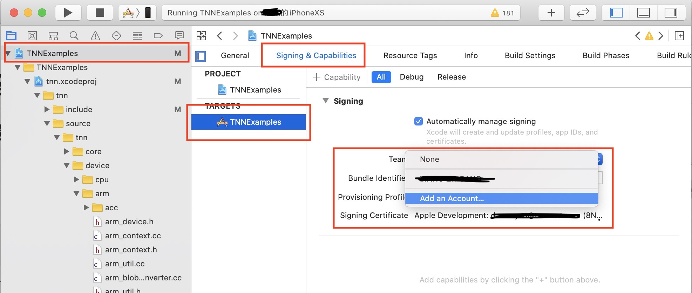
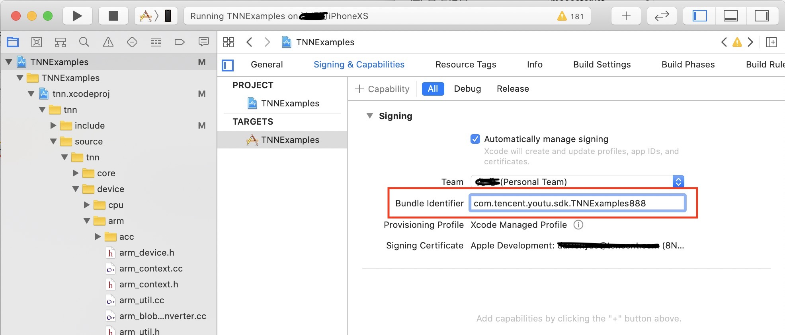
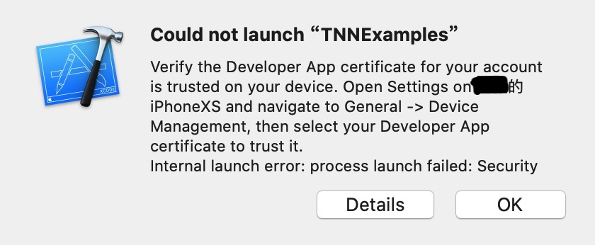
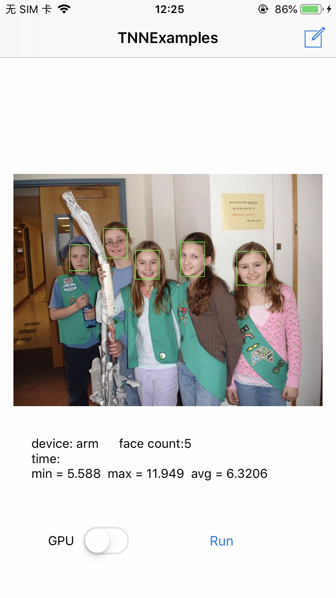
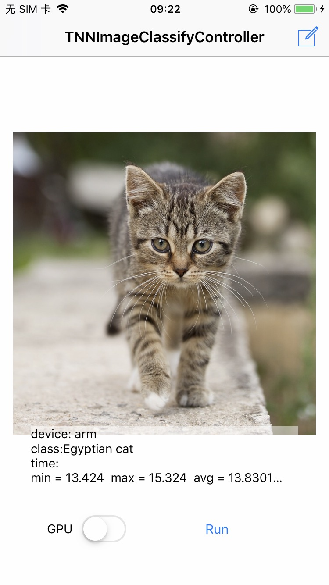
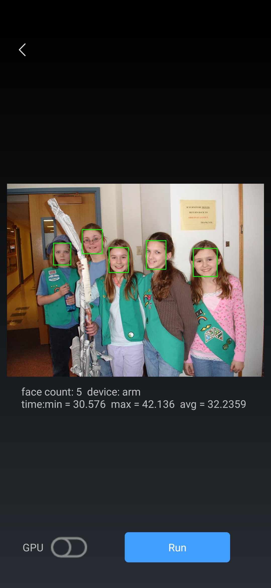
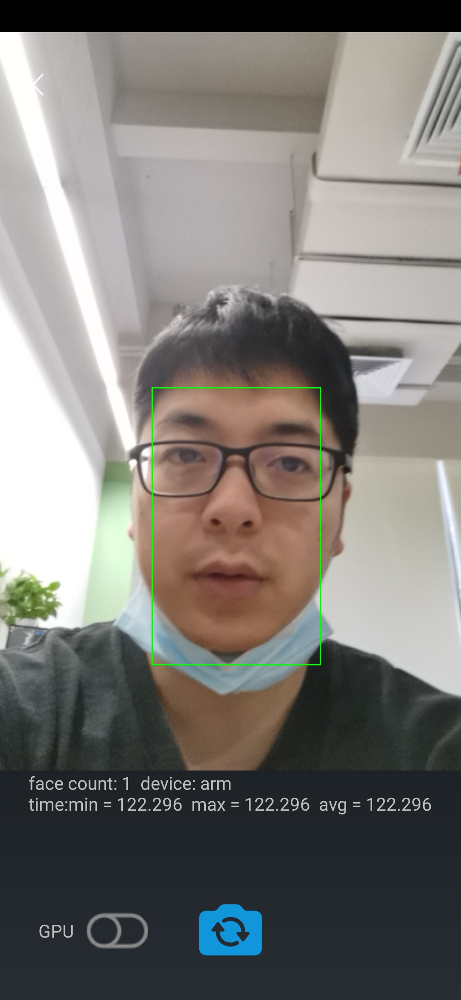
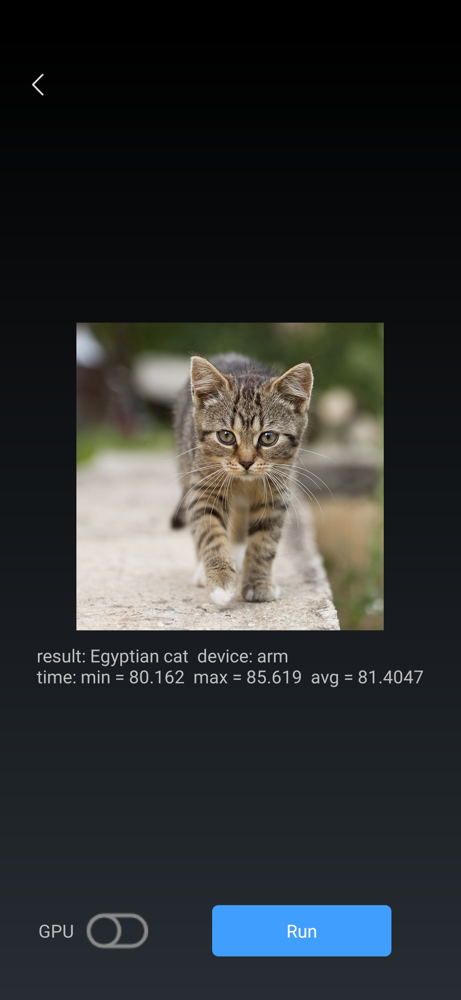

# Demo 代码介绍

## 一、iOS Demo 介绍

### Demo运行步骤

1. 下载Demo模型

   ```
   cd <path_to_tnn>/model
   sh download_model.sh
   ```

   PS: 如因网络问题脚本无法下载模型，请根据脚本中的信息手动创建对应文件夹并自行下载

2. 打开TNNExamples工程

   进入目录`<path_to_tnn>/examples/ios/`，双击打开TNNExamples工程。

3. 设置开发者账号

   如下图点击TNNExamples工程，找到工程设置`Signing & Capabilities`，点击Team选项卡选择`Add an Account...`

   <div align=left >

   在如下界面输入Apple ID账号和密码，添加完成后回到`Signing & Capabilities`界面，并在Team选项卡中选中添加的账号。如果没有Apple ID也可以通过`Create Apple ID`选项根据相关提示进行申请。

   `PS：申请Apple ID无需付费，可以即时通过，通过后才可在真机上运行APP调试`

   <div align=left >

4. 真机运行  

   4.1 修改`Bundle Identitifier`

   如图在现有`Bundle Identifier`后随机添加后缀（限数字和字母），避免个人账户遇到签名冲突。

   <div align=left >

4.2 验证授权
   
首次运行先利用快捷键`Command + Shift + K`对工程进行清理，再执行快捷键`Command + R`运行。如果是首次登陆Apple ID，Xcode会弹框报如下错误，需要在iOS设备上根据提示进行授权验证。一般来说手机上的授权路径为：设置 -> 通用 -> 描述文件与设备管理 -> Apple Development选项 -> 点击信任

<div align=left >

4.3 运行结果
   
首次运行先利用快捷键`Command + Shift + K`对工程进行清理，再执行快捷键`Command + R`运行。默认界面为人脸检测，可以点击右上角编辑按钮切换图像分类等不同功能。
   
PS：
   
a) 由于GPU和CPU加速原理不同，具体模型的GPU性能不一定比CPU高，与具体机型、模型结构以及工程实现有关。欢迎大家参与到TNN开发中，共同进步。
   
b) TNNSDKSample.h中的宏TNN_SDK_USE_NCNN_MODEL默认为0，运行TNN模型，可以设置为1来运行ncnn模型。
   
   c) 如遇到`Unable to install...`错误提示，请在真机设备上删除已有的TNNExamples，重新运行安装。
   
   d) 真机运行时，如果遇到CodeSign错误`Command CodeSign failed with a nonzero exit code`，可参看issue20 `iOS Demo运行步骤说明`

### Demo运行效果

1. 人脸检测

   模型来源：https://github.com/Linzaer/Ultra-Light-Fast-Generic-Face-Detector-1MB

   效果示例：iPhone 7, ARM 单线程 6.3206ms

  <div align=left >

2. 图像分类

   模型来源：https://github.com/forresti/SqueezeNet

   效果示例：iPhone 7, ARM 单线程 13.83ms

  <div align =left >

## 二、Android Demo 介绍

### 运行环境要求

1. Android Studio 3.5 或以上
2. NDK version >= 16

### 运行步骤

1. 下载Demo模型

   ```
   cd <path_to_tnn>/model
   sh download_model.sh
   ```

   PS: 如因网络问题脚本无法下载模型，请根据脚本中的信息手动创建对应文件夹并自行下载

2. 打开TNNExamples工程

   进入目录`<path_to_tnn>/examples/android/`，双击打开TNNExamples工程。

### 运行效果
1. 人脸检测-图片
   
   模型来源：https://github.com/Linzaer/Ultra-Light-Fast-Generic-Face-Detector-1MB

   效果示例：华为P30, ARM 单线程 32.2359ms

   <div align=left >

2. 人脸检测-视频
   模型来源：https://github.com/Linzaer/Ultra-Light-Fast-Generic-Face-Detector-1MB

   效果示例：华为P30, ARM 单线程 122.296ms

   <div align=left >

3. 图像分类

   模型来源：https://github.com/forresti/SqueezeNet

   效果示例：华为P30, ARM 单线程 81.4047ms

   <div align=left >

## 三、Armlinux Demo 介绍

### 功能
* 展示TNN基础接口的调用方法，快速在linux环境下运行模型。

### 编译
* 参见[arm linux Readme文档](/examples/armlinux/Readme.md)

### Init 函数流程

1. 在 TNN_NS::ModelConfig 中指明模型文件路径，创建TNN_NS::TNN 实例。

具体代码：

    TNN_NS::ModelConfig model_config;
    model_config.params.push_back(buffer);
    model_config.params.push_back(model_file);
    CHECK_TNN_STATUS(tnn_.Init(model_config));

2. 在 TNN_NS::NetworkConfig 中指明设备类型等信息，创建TNN_NS::Instance 实例。

具体代码:


    TNN_NS::NetworkConfig config;
    config.device_type = TNN_NS::DEVICE_ARM;
    TNN_NS::Status error;
    net_instance_      = tnn_.CreateInst(config, error);
    CHECK_TNN_STATUS(error);

3. 获取输入输出信息。

具体代码

    CHECK_TNN_STATUS(net_instance_->GetAllInputBlobs(input_blobs_));
    CHECK_TNN_STATUS(net_instance_->GetAllOutputBlobs(output_blobs_));

### Forward 函数流程

1. 预处理及数据传入。

具体代码:

    TNN_NS::BlobConverter input_blob_convert(input_blobs_.begin()->second);
    CHECK_TNN_STATUS(
        input_blob_convert.ConvertFromMat(input_mat, input_convert_param_, nullptr));

2. 前向计算。

具体代码:

    CHECK_TNN_STATUS( net_instance_->Forward());

3. 数据传出及后处理。

具体代码:

    TNN_NS::BlobConverter output_blob_convert(output_blobs_.begin()->second);
    CHECK_TNN_STATUS(
        output_blob_convert.ConvertToMat(output_mat, output_convert_param_, nullptr));


## 四、NCNN 模型使用及接口介绍

- [NCNN相关](ncnn.md)
