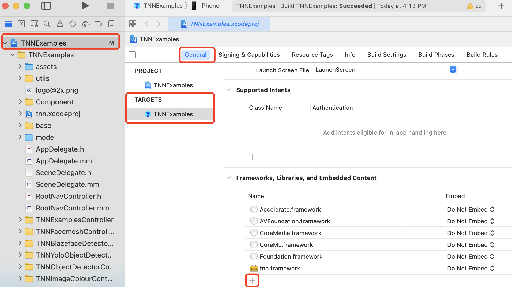
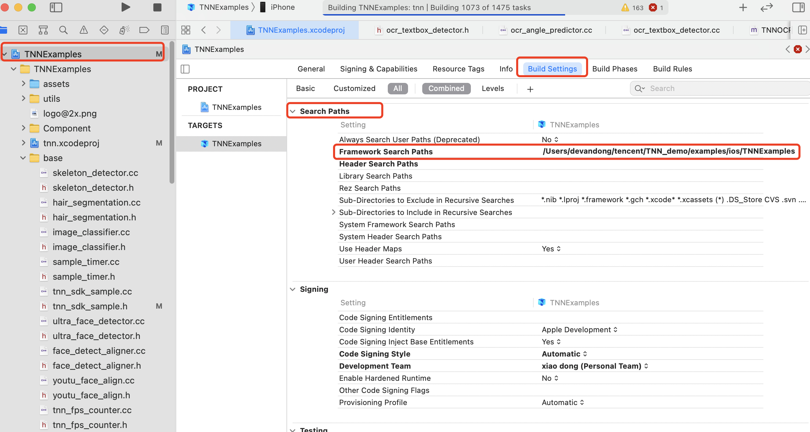

# Demo 代码介绍

[English Version](../../en/user/demo_en.md)

## 一、iOS Demo 介绍

### Demo运行步骤

1. 下载Demo模型

   ```
   cd <path_to_tnn>/model
   sh download_model.sh
   ```
   
   可选：如果需要执行OCR demo，还需要准备opencv库。可以使用提供的脚本下载opencv。
   ```
   cd <path_to_tnn>/scripts
   sh download_opencv.sh iOS
   ```

   PS: 如因网络问题脚本无法下载模型或依赖库，请根据脚本中的信息手动创建对应文件夹并自行下载。模型也可以阿里云盘下载，https://www.aliyundrive.com/s/MSmarP3zqrb

2. 打开TNNExamples工程

   进入目录`<path_to_tnn>/examples/ios/`，双击打开TNNExamples工程。
   
   可选：如果需要执行OCR demo，需要将opencv加入TNNExamples的依赖项中。
   
   如下图点击TNNExamples工程，找到工程设置`General`，在`Framworks, Libraries, and Embedded Content`选项卡下点击`+`。

   <div align=left >

   在打开的界面中选择`Add Other-Add Files...`，找到opencv2.framework，并添加。使用提供的`<path_to_tnn>/scripts/download_opencv.sh`时，下载的opencv位于`<path_to_tnn>/third_party/opencv/iOS`目录下。

   <div align=left >

   由于opencv2.framework中包含真机和模拟器多平台的代码，需要按下图将`Embed`选项设置为`Do Not Embed`。

   <div align=left >

   最后，为了确保编译器可以找到opencv.framework，需要确认opencv.framework所在目录被添加到`Framework Search Paths`中。如下图所示，找到工程设置`Build Settings`，在`Search Paths`选项卡下找到`Framework Search Paths`。如果opencv.framework所在的目录不存在，需要双击这一条目，并添加。

    <div align=left >


3. 设置开发者账号

   如下图点击TNNExamples工程，找到工程设置`Signing & Capabilities`，点击Team选项卡选择`Add an Account...`

   <div align=left >

   在如下界面输入Apple ID账号和密码，添加完成后回到`Signing & Capabilities`界面，并在Team选项卡中选中添加的账号。如果没有Apple ID也可以通过`Create Apple ID`选项根据相关提示进行申请。

   `PS：申请Apple ID无需付费，可以即时通过，通过后才可在真机上运行APP调试`

   <div align=left >

4. 真机运行  

   4.1 修改`Bundle Identitifier`

   如图在现有`Bundle Identifier`后随机添加后缀（限数字和字母），避免个人账户遇到签名冲突。

   <div align=left >

4.2 验证授权

首次运行先利用快捷键`Command + Shift + K`对工程进行清理，再执行快捷键`Command + R`运行。如果是首次登陆Apple ID，Xcode会弹框报如下错误，需要在iOS设备上根据提示进行授权验证。一般来说手机上的授权路径为：设置 -> 通用 -> 描述文件与设备管理 -> Apple Development选项 -> 点击信任

<div align=left >

4.3 运行结果

首次运行先利用快捷键`Command + Shift + K`对工程进行清理，再执行快捷键`Command + R`运行。默认界面为人脸检测，可以点击右上角编辑按钮切换图像分类等不同功能。

PS：

a) 由于GPU和CPU加速原理不同，具体模型的GPU性能不一定比CPU高，与具体机型、模型结构以及工程实现有关。欢迎大家参与到TNN开发中，共同进步。

b) tnn_sdk_sample.h中的宏TNN_SDK_USE_NCNN_MODEL默认为0，运行TNN模型，可以设置为1来运行ncnn模型。

   c) 如遇到`Unable to install...`错误提示，请在真机设备上删除已有的TNNExamples，重新运行安装。

   d) 真机运行时，如果遇到CodeSign错误`Command CodeSign failed with a nonzero exit code`，可参看issue20 `iOS Demo运行步骤说明`

c) 如果需要执行OCR demo，需要将tnn_sdk_sample.h中的宏HAS_OPENCV设置为1，否则不会编译OCR demo代码。

### Demo运行效果

1. 人脸检测

   模型来源：https://github.com/Linzaer/Ultra-Light-Fast-Generic-Face-Detector-1MB

   效果示例：iPhone 7, ARM 单线程 6.3206ms

  <div align=left >

2. 图像分类

   模型来源：https://github.com/forresti/SqueezeNet

   效果示例：iPhone 7, ARM 单线程 13.83ms

  <div align =left >

## 二、Android Demo 介绍

### 运行环境要求

1. Android Studio 3.5 或以上
2. NDK version >= 18, <= 21
NDK 22和23在链接第三方动态库可能会出错，例如opencv，hiai，不建议使用。

### 运行步骤

1. 下载Demo模型

   ```
   cd <path_to_tnn>/model
   sh download_model.sh
   ```

   可选：如果需要执行OCR demo，还需要下载opencv库。
   ```
   cd <path_to_tnn>/scripts
   sh download_opencv.sh android
   ```

   PS: 
   
   如因网络问题脚本无法下载模型，请根据脚本中的信息手动创建对应文件夹并自行下载. 模型也可以阿里云盘下载，https://www.aliyundrive.com/s/MSmarP3zqrb
   
    想要使用NPU运行demo需要需首先下载NPU ddk。详情参考: [FAQ](../faq.md): 创建华为NPU编译环境。

2. 打开TNNExamples工程

   - 进入目录`<path_to_tnn>/examples/android/`，双击打开TNNExamples工程文件`build.gradle`。

   - 将手机连接到电脑，点击`Run Demo`编译和运行demo。

   - 工程默认编译64位armv8库，如要添加32位armv7库，可在`build.gradle`中修改为`abiFilters "armeabi-v7a", "arm64-v8a"`。

   PS ：
   
   1).  想要使用NPU, 打开工程后，需要手动设置打开NPU：
   在<path_to_tnn>/examples/android/demo/CMakeList.txt中, 更新指令为如下，使用华为NPU。
   ````
        set(TNN_HUAWEI_NPU_ENABLE ON CACHE BOOL "" FORCE)
   ````
   2). 第一次运行如果遇到 `<path_to_tnn>/examples/android/src/main/jni/thirdparty/hiai_ddk/include/graph`Permission Denied 的情况，
   Clean Project 再重新运行。
   
   3). 当前只有rom版本 >= 100.320.xxx.xxxx的华为机型支持IR构建事例模型。参考：[FAQ](../faq.md): 更新到最新的ROM支持NPU。
   
   4). 运行demo需要需首先下载NPU DDK。参考: [FAQ](../faq.md): 创建华为NPU编译环境。

   5). 想要执行OCR demo, 打开工程后，需要手动设置打开OPENCV依赖：
   在<path_to_tnn>/examples/android/demo/CMakeList.txt中, 更新指令为如下，使用OPENCV。
   ````
        set(TNN_OPENCV_ENABLE ON CACHE BOOL "" FORCE)
   ````

   如果通过上述`download_opencv.sh`下载OpenCV库，不需要再指定路径。
   如果想要使用自定义的OpenCV Android SDK，需要指定OPENCV_ANDROID_SDK_PATH路径。
   在<path_to_tnn>/examples/android/demo/CMakeList.txt中, 更新指令为如下。
   ````
        set(OPENCV_ANDROID_SDK_PATH <path_to_opencv_android_sdk>)
   ````
      
 
### 运行效果
1. 人脸检测-图片

   模型来源：https://github.com/Linzaer/Ultra-Light-Fast-Generic-Face-Detector-1MB

   效果示例：华为P40, ARM 单线程 32.2359ms

   <div align=left >
    
    效果示例： 华为P40, 华为NPU rom 100.320.010.022 9.04ms
    
    <div align=left >
    

2. 人脸检测-视频
   模型来源：https://github.com/Linzaer/Ultra-Light-Fast-Generic-Face-Detector-1MB

   效果示例：华为P40, ARM 单线程 122.296ms

   <div align=left >
    
    效果示例： 华为P40, 华为NPU rom 100.320.010.022 28ms
    
    <div align=left >

3. 图像分类

   模型来源：https://github.com/forresti/SqueezeNet

   效果示例：华为P40, ARM 单线程 81.4047ms

   <div align=left >
    
   效果示例： 华为P40, NPU rom 100.320.010.022 2.48ms
    
   <div align=left >
    
## 三、Linux/Mac/Windows/ArmLinux/CudaLinux Demo 介绍
### 功能
* 快速在 Linux/Mac/Windows/ArmLinux/CudaLinux 环境下运行模型，展示 TNN 接口的使用方法。<br>
**注意：demo sdk 请使用推荐模型，如需使用其他模型需要修改 sdk 预处理及后处理功能适应不同模型的输入输出差异**

### 使用步骤
#### 1. 下载 Demo 模型
   ```
   cd <path_to_tnn>/model
   sh download_model.sh
   ```
   如因网络问题脚本无法下载模型，请根据脚本中的信息手动创建对应文件夹并自行下载。模型也可以阿里云盘下载，https://www.aliyundrive.com/s/MSmarP3zqrb

#### 2. 编译
##### Linux
* 环境要求  
   - Cmake (>=3.11)
   - OpenCV3 (只有webcam的demo会用), 可在CMake中通过find_package(OpenCV 3) 成功找到依赖项。

   ```
   // 手动编译OpenCV3
   wget https://github.com/opencv/opencv/archive/3.4.13.zip
   unzip 3.4.13.zip
   cd opencv-3.4.13

   mkdir build
   mkdir install
   cd build

   cmake -DCMAKE_INSTALL_PREFIX=../install ..
   make -j4
   make install

   // 在CMakeList.txt的find_packpage之前添加OpenCV路径
   // 例如，进入examples/linux/x86，打开CMakeList.txt
   // 在find_package(OpenCV 3 REQUIRED)之前添加
   set(OpenCV_DIR <path_to_opencv>/opencv-3.4.13/install/share/OpenCV)
   ```

* 编译  
   进入 `examples/linux/x86` 目录，执行 `build_linux_native.sh`或`build_linux_openvino.sh`。前者使用TNN实现的优化X86后端执行，后者基于Intel OpenVINO后端执行。以`build_linux_native.sh`为例，默认仅编译处理图像的demo，如需编译基于摄像头的人脸配准demo，需要将`build_linux_native.sh`中的"-DTNN_DEMO_WITH_WEBCAM=OFF"修改为"-DTNN_DEMO_WITH_WEBCAM=ON":
   ```
   cd <path_to_tnn>/examples/linux/x86
   ./build_linux_native.sh
   ```
* 执行  
   进入 `examples/linux/x86/build_linux_native` 或 `examples/linux/x86/build_linux_openvino` 目录，当不使用任何参数执行demo文件时，会打印demo用法信息，以图形分类demo为例:
   ```
   cd build_linux_native
   ./demo_x86_imageclassify
   >Parameter -m and -p should be set 
   >usage:
   >./demo_x86_imageclassify [-h] [-p] tnnproto [-m] tnnmodel [-i] <input>
   >     -h, <help>      print a usage message.
   >     -p, <proto>     (required) tnn proto file path
   >     -m, <model>     (required) tnn model file path
   >     -i, <input>     (required) input file path
   >     -l, <label>     (optional) label file path. Default is: ../../../assets/synset.txt

   ```
   `-p`和`-m`选项分别用于指定demo使用的tnnproto和tnnmodel文件的路径；`-i`选项用于指定输入图片的路径；`-l`选项用于指定分类标签文件的路径。`-h`选项打印帮助信息。各个demo的示例用法如下所示:
   ```
   cd build_linux_native

   图形分类 demo
   ./demo_x86_imageclassify -p ../../../../model/SqueezeNet/squeezenet_v1.1.tnnproto -m ../../../../model/SqueezeNet/squeezenet_v1.1.tnnmodel -i ../../../assets/tiger_cat.jpg

   人脸检测 demo
   ./demo_x86_facedetector -p ../../../../model/face_detector/version-slim-320_simplified.tnnproto -m ../../../../model/face_detector/version-slim-320_simplified.tnnmodel -i ../../../assets/test_face.jpg

   物体检测 demo
   ./demo_x86_objectdetector -p ../../../../model/yolov5/yolov5s.tnnproto -m ../../../../model/yolov5/yolov5s.tnnmodel -i ../../../assets/004545.jpg

   阅读理解 demo
   ./demo_x86_readingcomprehension -p ../../../../model/bertsquad10/bertsquad10_clean.tnnproto -m ../../../../model/bertsquad10/bertsquad10_clean.tnnmodel -v ../../../../model/bertsquad10/vocab.txt

   姿势检测 demo (腾讯光流)
   ./demo_x86_posedetector -p ../../../../model/skeleton/skeleton_big.tnnproto -m ../../../../model/skeleton/skeleton.tnnmodel -i ../../../assets/skeleton_test.jpg

   姿势检测 demo (blazepose)
   ./demo_x86_blazepose

   文本识别 demo
   ./demo_x86_ocrdetecor

   摄像头人脸配准 demo
   ./demo_x86_webcam
   ```

##### MacOS
* 环境要求
   - Cmake (>=3.11)
   - OpenCV3 (只有webcam的demo会用), 确保可在CMake中通过 `find_package(OpenCV 3)`找到， 可通过brew安装(```brew install opencv@3 && brew link --force opencv@3```)，如果失败可使用手动编译

   ```
   // 手动编译OpenCV3
   wget https://github.com/opencv/opencv/archive/3.4.13.zip
   unzip 3.4.13.zip
   cd opencv-3.4.13

   mkdir build
   mkdir install
   cd build

   cmake -DCMAKE_INSTALL_PREFIX=../install ..
   make -j4
   make install

   // 在CMakeList.txt的find_packpage之前添加OpenCV路径
   // 例如，进入examples/mac/x86，打开CMakeList.txt
   // 在find_package(OpenCV 3 REQUIRED)之前添加
   set(OpenCV_DIR <path_to_opencv>/opencv-3.4.13/install/share/OpenCV)
   ```

* 编译  
   进入 `examples/mac/x86` 目录，执行 `build_macos_native.sh`或`build_macos_openvino.sh`。前者使用TNN实现的优化X86后端执行，后者基于Intel OpenVINO后端执行。以`build_macos_native.sh`为例，默认仅编译处理图像的demo，如需编译基于摄像头的人脸配准demo，需要将`build_macos_native.sh`中的"-DTNN_DEMO_WITH_WEBCAM=OFF"修改为"-DTNN_DEMO_WITH_WEBCAM=ON":
   ```
   cd <path_to_tnn>/examples/mac/x86
   ./build_macos_native.sh
   ```
* 执行  
   进入 `examples/mac/x86/build_macos_native` 或 `examples/mac/x86/build_macos_openvino` 目录，当不使用任何参数执行demo文件时，会打印demo用法信息，以图形分类demo为例:
   ```
   cd build_macos_native
   ./demo_x86_imageclassify
   >Parameter -m and -p should be set 
   >usage:
   >./demo_x86_imageclassify [-h] [-p] tnnproto [-m] tnnmodel [-i] <input>
   >     -h, <help>      print a usage message.
   >     -p, <proto>     (required) tnn proto file path
   >     -m, <model>     (required) tnn model file path
   >     -i, <input>     (required) input file path
   >     -l, <label>     (optional) label file path. Default is: ../../../assets/synset.txt
   ```
   `-p`和`-m`选项分别用于指定demo使用的tnnproto和tnnmodel文件的路径；`-i`选项用于指定输入图片的路径；`-l`选项用于指定分类标签文件的路径。`-h`选项打印帮助信息。各个demo的示例用法如下所示:
   ```
   cd build_macos_native
   
   图形分类 demo
   ./demo_x86_imageclassify -p ../../../../model/SqueezeNet/squeezenet_v1.1.tnnproto -m ../../../../model/SqueezeNet/squeezenet_v1.1.tnnmodel -i ../../../assets/tiger_cat.jpg

   人脸检测 demo
   ./demo_x86_facedetector -p ../../../../model/face_detector/version-slim-320_simplified.tnnproto -m ../../../../model/face_detector/version-slim-320_simplified.tnnmodel -i ../../../assets/test_face.jpg

   物体检测 demo
   ./demo_x86_objectdetector -p ../../../../model/yolov5/yolov5s.tnnproto -m ../../../../model/yolov5/yolov5s.tnnmodel -i ../../../assets/004545.jpg

   阅读理解 demo
   ./demo_x86_readingcomprehension -p ../../../../model/bertsquad10/bertsquad10_clean.tnnproto -m ../../../../model/bertsquad10/bertsquad10_clean.tnnmodel -v ../../../../model/bertsquad10/vocab.txt

   姿势检测 demo (腾讯光流)
   ./demo_x86_posedetector -p ../../../../model/skeleton/skeleton_big.tnnproto -m ../../../../model/skeleton/skeleton.tnnmodel -i ../../../assets/skeleton_test.jpg

   姿势检测 demo (blazepose)
   ./demo_x86_blazepose

   文本识别 demo
   ./demo_x86_ocrdetecor

   摄像头人脸配准 demo
   ./demo_x86_webcam
   ```

##### Windows
* 环境要求  
   - Visual Studio (>=2017)
   - Cmake (>=3.11 或使用 Visual Studio Prompt 运行脚本)
   - OpenCV3，需要使用相同版本的vc编译。
* 编译  
   打开 `x64 Native Tools Command Prompt for VS 2017/2019`.
   进入 `examples\windows\x86` 目录，执行 `build_msvc_native.bat`或`build_msvc_openvino.bat`。前者使用TNN实现的优化X86后端执行，后者基于Intel OpenVINO后端执行。以`build_msvc_native.bat`为例，默认仅编译处理图像的demo，如需编译基于摄像头的人脸配准demo，需要将`build_msvc_native.bat`中的"-DTNN_DEMO_WITH_WEBCAM=OFF"修改为"-DTNN_DEMO_WITH_WEBCAM=ON":
   ```
   set OpenCV_DIR=`OPENCV_INSTALL_DIR`
   cd <path_to_tnn>\examples\windows\x86
   .\build_msvc_native.bat
   ```
* 执行  
   进入 `examples\windows\x86\build_msvc_native\release` 目录，当不使用任何参数执行demo文件时，会打印demo用法信息，以图形分类demo为例:
   ```
   cd build_msvc_native\release
   .\demo_x86_imageclassify
   >Parameter -m and -p should be set 
   >usage:
   >.\demo_x86_imageclassify [-h] [-p] tnnproto [-m] tnnmodel [-i] <input>
   >     -h, <help>      print a usage message.
   >     -p, <proto>     (required) tnn proto file path
   >     -m, <model>     (required) tnn model file path
   >     -i, <input>     (required) input file path
   >     -l, <label>     (optional) label file path. Default is: ../../../assets/synset.txt
   ```
   `-p`和`-m`选项分别用于指定demo使用的tnnproto和tnnmodel文件的路径；`-i`选项用于指定输入图片的路径；`-l`选项用于指定分类标签文件的路径。`-h`选项打印帮助信息。各个demo的示例用法如下所示:
   ```
   cd build_msvc_native\release
   
   图形分类 demo
   .\demo_x86_imageclassify -p ..\..\..\..\..\model\SqueezeNet\squeezenet_v1.1.tnnproto -m ..\..\..\..\..\model\SqueezeNet\squeezenet_v1.1.tnnmodel -i ..\..\..\..\assets\tiger_cat.jpg

   人脸检测 demo
   .\demo_x86_facedetector -p ..\..\..\..\..\model\face_detector\version-slim-320_simplified.tnnproto -m ..\..\..\..\..\model\face_detector\version-slim-320_simplified.tnnmodel -i ..\..\..\..\assets\test_face.jpg

   物体检测 demo
   .\demo_x86_objectdetector -p ..\..\..\..\model\mobilenet_v2-ssd\mobilenetv2_ssd_tf.tnnproto -m ..\..\..\..\model\mobilenet_v2-ssd\mobilenetv2_ssd_tf.tnnmodel -i ..\..\..\assets\004545.jpg

   阅读理解 demo
   .\demo_x86_readingcomprehension -p ..\..\..\..\..\model\bertsquad10\bertsquad10_clean.tnnproto -m ..\..\..\..\..\model\bertsquad10\bertsquad10_clean.tnnmodel -v ..\..\..\..\..\model\bertsquad10\vocab.txt

   姿势检测 demo (腾讯光流)
   .\demo_x86_posedetector -p ..\..\..\..\model\skeleton\skeleton_big.tnnproto -m ..\..\..\..\model\skeleton\skeleton.tnnmodel -i ..\..\..\assets\skeleton_test.jpg

   姿势检测 demo (blazepose)
   .\demo_x86_blazepose

   文本识别 demo
   .\demo_x86_ocrdetecor
   
   摄像头人脸检测配准 demo
   .\demo_x86_webcam
   ```

##### ArmLinux
* 环境要求
   - Cmake (>= 3.1)
   - 交叉编译需要安装编译工具链
   - ubuntu: aarch64: sudo apt-get install g++-aarch64-linux-gnu      gcc-aarch64-linux-gnu  
      arm32hf: sudo apt-get install g++-arm-linux-gnueabihf  gcc-arm-linux-gnueabihf
   - other linux: 下载 arm toolchain: https://developer.arm.com/tools-and-software/open-source-software/developer-tools/gnu-toolchain/gnu-a/downloads
* 编译  
   进入 `examples/linux/cross` 目录
   ```
   cd <path_to_tnn>/examples/linux/cross
   ```
   修改 `build_aarch64_linux.sh` 或 `build_armhf_linux.sh`，以aarch64为例，需要配置编译选项：
   ```
   CC=aarch64-linux-gnu-gcc
   CXX=aarch64-linux-gnu-g++
   TNN_LIB_PATH=../../../scripts/build_aarch64_linux/
   ```
   执行 `build_aarch64_linux.sh`
   ```
   sh build_aarch64_linux.sh
   ```
* 执行  
   进入 `examples/linux/cross/build` 目录，当不使用任何参数执行demo文件时，会打印demo用法信息，以图形分类demo为例:
   ```
   cd build
   ./demo_arm_linux_imageclassify
   >Parameter -m and -p should be set 
   >usage:
   >./demo_arm_linux_imageclassify [-h] [-p] tnnproto [-m] tnnmodel [-i] <input>
   >     -h, <help>      print a usage message.
   >     -p, <proto>     (required) tnn proto file path
   >     -m, <model>     (required) tnn model file path
   >     -i, <input>     (required) input file path
   >     -l, <label>     (optional) label file path. Default is: ../../../assets/synset.txt
   ```
   `-p`和`-m`选项分别用于指定demo使用的tnnproto和tnnmodel文件的路径；`-i`选项用于指定输入图片的路径；`-l`选项用于指定分类标签文件的路径。`-h`选项打印帮助信息。各个demo的示例用法如下所示:
   ```
   cd build

   图形分类 demo
   ./demo_arm_linux_imageclassify -p ../../../../model/SqueezeNet/squeezenet_v1.1.tnnproto -m ../../../../model/SqueezeNet/squeezenet_v1.1.tnnmodel -i ../../../assets/tiger_cat.jpg

   人脸检测 demo
   ./demo_arm_linux_facedetector -p ../../../../model/face_detector/version-slim-320_simplified.tnnproto -m ../../../../model/face_detector/version-slim-320_simplified.tnnmodel -i ../../../assets/test_face.jpg

   物体检测 demo
   ./demo_arm_linux_objectdetector -p ../../../../model/mobilenet_v2-ssd/mobilenetv2_ssd_tf.tnnproto -m ../../../../model/mobilenet_v2-ssd/mobilenetv2_ssd_tf.tnnmodel -i ../../../assets/004545.jpg
   ```

##### CudaLinux
* 环境要求
   - Cmake (>= 3.8)
   - CUDA (>= 10.2)
   - TensorRT (>= 7.1)

* 编译
   设置环境变量 `TENSORRT_ROOT_DIR`
   ```
   export TENSORRT_ROOT_DIR = <TensorRT_path>
   ```
   设置环境变量 `CUDNN_ROOT_DIR`
   ```
   export CUDNN_ROOT_DIR = <CuDNN_path>
   ```
   进入 `examples/linux/cuda` 目录, 执行 `build_linux.sh`:
   ```
   cd <path_to_tnn>/examples/linux/cuda
   sh build_linux.sh
   ```
* 执行
   进入 `examples/linux/cuda/build_cuda_linux` 目录，当不使用任何参数执行demo文件时，会打印demo用法信息，以图形分类demo为例:
   ```
   cd build_cuda_linux
   ./demo_cuda_imageclassify
   >Parameter -m and -p should be set 
   >usage:
   >./demo_cuda_imageclassify [-h] [-p] tnnproto [-m] tnnmodel [-i] <input>
   >     -h, <help>      print a usage message.
   >     -p, <proto>     (required) tnn proto file path
   >     -m, <model>     (required) tnn model file path
   >     -i, <input>     (required) input file path
   >     -l, <label>     (optional) label file path. Default is: ../../../assets/synset.txt
   ```
   `-p`和`-m`选项分别用于指定demo使用的tnnproto和tnnmodel文件的路径；`-i`选项用于指定输入图片的路径；`-l`选项用于指定分类标签文件的路径。`-h`选项打印帮助信息。各个demo的示例用法如下所示:
   ```
   cd build_cuda_linux

   图形分类 demo
   ./demo_cuda_imageclassify -p ../../../../model/SqueezeNet/squeezenet_v1.1.tnnproto -m ../../../../model/SqueezeNet/squeezenet_v1.1.tnnmodel -i ../../../assets/tiger_cat.jpg

   人脸检测 demo
   ./demo_cuda_facedetector -p ../../../../model/face_detector/version-slim-320_simplified.tnnproto -m ../../../../model/face_detector/version-slim-320_simplified.tnnmodel -i ../../../assets/test_face.jpg

   物体检测 demo
   ./demo_cuda_objectdetector -p ../../../../model/yolov5/yolov5s.tnnproto -m ../../../../model/yolov5/yolov5s.tnnmodel -i ../../../assets/004545.jpg

   阅读理解 demo
   ./demo_cuda_readingcomprehension -p ../../../../model/bertsquad10/bertsquad10_clean.tnnproto -m ../../../../model/bertsquad10/bertsquad10_clean.tnnmodel -v ../../../../model/bertsquad10/vocab.txt

   姿势检测 demo (腾讯光流)
   ./demo_cuda_posedetector -p ../../../../model/skeleton/skeleton_big.tnnproto -m ../../../../model/skeleton/skeleton.tnnmodel -i ../../../assets/skeleton_test.jpg

   姿势检测 demo (blazepose)
   ./demo_cuda_blazepose

   文本识别 demo
   ./demo_cuda_ocrdetecor
   ```

### 常见问题

#### Demo执行问题
1. 执行demo时报错: "open file xxx failed"

   该错误由输入图像路径错误引起，请检查输入文件的路径

2. 执行demo时报错: "open lable file xxx failed"

   该错误由输入标签文件路径错误引起，图像分类demo需要预定义的标签文件，默认文件路径在`<path_to_tnn>/examples/assets/synset.txt`

#### CUDA编译问题

1. 编译时报错: "not defined environment variable:CUDNN_ROOT_DIR"或"not defined environment variable:TENSORRT_ROOT_DIR"

   请根据CUDA编译步骤，检查环境变量`CUDNN_ROOT_DIR`和`TENSORRT_ROOT_DIR`是否正确设置
### 函数流程
#### 图像分类函数流程
* 创建predictor
   ```cpp
   auto predictor = std::make_shared<ImageClassifier>();
   ```
* 初始化predictor  
   ```cpp
   CHECK_TNN_STATUS(predictor->Init(option));
   // 对 Linux/Window(X86 native / OPENVINO)
   option->compute_units = TNN_NS::TNNComputeUnitsCPU;
   // 对 ArmLinux
   option->compute_units = TNN_NS::TNNComputeUnitsCPU;
   // 对 CUDA
   option->compute_units = TNN_NS::TNNComputeUnitsGPU;
   ```
* 创建输入mat  
   ```cpp
   // 对 Linux/Window(OpenVINO)
   auto image_mat = std::make_shared<TNN_NS::Mat>(TNN_NS::DEVICE_X86, TNN_NS::N8UC3, nchw, data);
   // 对 Linux/Window(X86 native)
   auto image_mat = std::make_shared<TNN_NS::Mat>(TNN_NS::DEVICE_NAIVE, TNN_NS::N8UC3, nchw, data);
   // 对 ArmLinux
   auto image_mat = std::make_shared<TNN_NS::Mat>(TNN_NS::DEVICE_ARM, TNN_NS::N8UC3, nchw, data);
   // 对 CUDA
   auto image_mat = std::make_shared<TNN_NS::Mat>(TNN_NS::DEVICE_NAIVE, TNN_NS::N8UC3, nchw, data);
   ```
* 执行predictor  
   ```cpp
   CHECK_TNN_STATUS(predictor->Predict(std::make_shared<TNNSDKInput>(image_mat), sdk_output));
   ```
#### 人脸检测函数流程
* 创建predictor  
   ```cpp
   auto predictor = std::make_shared<UltraFaceDetector>();
   ```
* 初始化predictor  
   ```cpp
   CHECK_TNN_STATUS(predictor->Init(option));
   // 对 Linux/Window(X86 native / OPENVINO)
   option->compute_units = TNN_NS::TNNComputeUnitsCPU;
   // 对 ArmLinux
   option->compute_units = TNN_NS::TNNComputeUnitsCPU;
   // 对 CUDA
   option->compute_units = TNN_NS::TNNComputeUnitsGPU;
   ```
* 创建输入mat  
   ```cpp
   // 对 Linux/Window(OpenVINO)
   auto image_mat = std::make_shared<TNN_NS::Mat>(TNN_NS::DEVICE_X86, TNN_NS::N8UC3, nchw, data);
   // 对 Linux/Window(X86 native)
   auto image_mat = std::make_shared<TNN_NS::Mat>(TNN_NS::DEVICE_NAIVE, TNN_NS::N8UC3, nchw, data);
   // 对 ArmLinux
   auto image_mat = std::make_shared<TNN_NS::Mat>(TNN_NS::DEVICE_ARM, TNN_NS::N8UC3, nchw, data);
   // 对 CUDA
   auto image_mat = std::make_shared<TNN_NS::Mat>(TNN_NS::DEVICE_NAIVE, TNN_NS::N8UC3, nchw, data);
   ```
* 执行predictor  
   ```cpp
   CHECK_TNN_STATUS(predictor->Predict(std::make_shared<UltraFaceDetectorInput>(image_mat), sdk_output));
   ```
* 人脸标记  
   ```cpp
   TNN_NS::Rectangle((void *)ifm_buf, image_orig_height, image_orig_width, face.x1, face.y1, face.x2, face.y2, scale_x, scale_y);
   ```

## 四、NCNN 模型使用及接口介绍

- [NCNN相关](ncnn.md)


