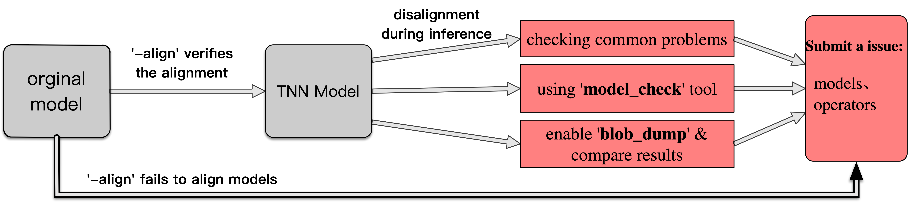

# Common Questions about Model Alignment

[中文版本](../cn/model_align.md)

When using TNN to perform inference with transformed tnn model, you may encounter disalignment of the inference result between the tnn model and the original model. This document summarizes the common reasons behind disalignment, operators related to disalignment, and solutions to resolve common alignment problems. The overal process of handling model alignment problems is shown below.

<div>

## I. Check if the tnn model is aligned

### 1. Using '-align' option when converting models

The TNN model converter is equipped with the alignment function and able to check if the converted tnn model is aligned with the original model. We strongly advise to enable the alignment function when you perform model conversion. The details of model converter could be found here:[Model Converter Document](https://github.com/Tencent/TNN/blob/master/doc/en/user/convert_en.md).

### 2. Using 'model_check' tool

For converted tnn models, TNN provides the **model_check** tool to help the alignment. The **model_check** tool is mainly designed for comparing the results of executions on different devices(e.g., ARM, OpenCL, Metal) and chekcing if they are same. When douting the tnn model results are wrong on a specific device, you can use this tool to verify your assumption.

The **model_check** tool can run the given TNN model on specified device with given or random input data, and compare the device result with the reference CPU result in a operator-to-operator manner. Thus, the oprtators that have the same input while giving different outputs between the test device and CPU are responsible for the disalignment. The usage of **model_check** can be found here:[model_check document](https://github.com/Tencent/TNN/blob/master/doc/en/development/model_check_en.md). 

## II. Known Problems related to Model Alignment

If the model converter has succeeded with alignment check, while you encountered alignment problems during the inference, you can try to solve the problem with the following steps.

Due to the diversity of neural networks and the inconsistent definitions and supports for operators between different frameworks, plus the changes with the updates of frameworks, it is hard to completely elinimate the inequivalence of operators. The following table summarizes the operators which may result in alignment problems, and you can check if these operators are responsible for your situation.

|Framework|Operators|
|-|-|
|Pytorch    |upsample, batchnorm, AvgPool|
|TensorFlow |TODO|
|tflite     |ResizeBilinear|
|onnx       |TODO|

### 1.tensorflow
TODO

### 2.pytorch

#### upsample 

Descciption: the upsample operator in onnx is inequivalent with the one in pytorch.

Solution: 1）update pytorch; 2）when exporting onnx model，set **opset_version>=11** like this:
```
torch.onnx.export(model, input, filename, verbose=False,
                  opset_version=11,...) # or other number greater than 11
```

#### batchnorm

Description: Forgetting to switch pytorch to the inference mode, making the param of batchnorm incorrect.

Solution: Switch to inference mode before exporting onnx model, the code should be like this:
```torch_model.eval()``` or ```torch_model.train(False)```

#### AvgPool

Description: the count_include_pad attribute of the AvgPool operator is discarded when converting to TNN models. TNN only support 'count_include_pad=```False``` for now.

Solution: change the count_include_pad to ```False``` before exporting the onnx model.

### 3.tflite

#### ResizeBilinear

Description: the ResizeBilinear operator has problem in tflite with version below 2.3

Solution: update TensorFlow to versions>=2.3

### 4.onnx
TODO

## III. Analysis & Solutions to Model Alignment Problems

When analyzing alignment problems, one of the most effective method is to compare the results for the same input. Specifically, we should get the TNN result of a specific operator and compare it with the result of the same operator from the original model. This could be achieved if we can save the input and output of each operator.

TNN suports dumping the result of each operator, and this could be achieved by the following steps.

### 1. eanble the 'blob dump' function

Open the file [source/tnn/utils/blob_dump_utils.h](https://github.com/Tencent/TNN/blob/master/source/tnn/utils/blob_dump_utils.h), change the macros `DUMP_INPUT_BLOB` and `DUMP_OUTPUT_BLOB`. Specifically, setting `DUMP_INPUT_BLOB` to `1` means saving the input for each opertor, and setting `DUMP_INPUT_BLOB` to `1` means dumping the output of each operator.

The procedure of saving data is called in the method `Forward` in file [source/tnn/core/default_network.cc](https://github.com/Tencent/TNN/blob/master/source/tnn/core/default_network.cc).

Specifically, TNN will save the input and output of each opeator in a separate txt file, and the filename is determined by **the order of this operator in the tnn model, the operator name and the shape of the data**. For example, assuing a layer named *foo* and it is the 2nd layer of the model, its 1st input will be save in a file whose name is prefixed by *00001-foo-in-0*. And the file for its second output will have a name like *00001-foo-out-1*. The data will be saved following a *N-C-H-W* layout and each line of the file is filled with one single value. The information about the input and output of each operator could be found through the [**Netron**](https://netron.app/) visualization tool.

The directory containg the files is determined by the variable `g_tnn_dump_directory` defined in file [source/tnn/utils/blob_dump_utils.cc](https://github.com/Tencent/TNN/blob/master/source/tnn/utils/blob_dump_utils.cc), and you could change it to your expected value.

### 2. Get each layer's input and output

Considering the saving process is called by the `Forward` method,myou can implement a simple program calling the `Forward` method. Besides, you can also make modifications on the code of existed TNN programs, such as the **TNNTest** tool. As **TNNTest** uses the asynchronous method `ForwardAsync` to perform the inference, you should open the file [test/test.cc](https://github.com/Tencent/TNN/blob/master/test/test.cc), find the calling to `ForwardAsync` and change it with the calling to `Forward`. If you are unfamiliar with the underlying details, you should change **all the 2 occurrences** like this:
replace
```
 ret = instance->ForwardAsync(nullptr);
```
with
```
ret = instance->Forward();
```

As the changes are made in source code, you should re-compile TNN to make them work. The steps to compile TNN can be found here:[TNN Compiling Document](https://github.com/Tencent/TNN/blob/master/doc/en/user/compile_en.md).
When the compilation finishes, you can use the **TNNTest** tool to execute the model and save the input and output of each operator. You can refer [TNNTest Document](https://github.com/Tencent/TNN/blob/master/doc/en/user/test_en.md) for usage of the **TNNTest**.

### 3. Getting the Results of Operators in the Original Model

The procedure to save operators' results closely relates to the corresponding framework. We use onnx as an example to show the method to save the result of each operator in the original model.
- onnx model: use `onnxruntime` to execute the model and save the output of each operator.
```
def forward_dump(model_path:str, input_data:numpy.ndarray) -> Dict[str, numpy.ndarray]:
    # 1. Load onnx model
    model = onnx.load(model_path)
    onnx.checker.check_model(model)
    model = copy.deepcopy(model)

    # 2. Prepare input data
    input_data = {'input_name': input_data}

    # 3. Set the output of each operator as the output of the model
    for node in model.graph.node:
        for output in node.output:
            model.graph.output.extend([onnx.ValueInfoProto(name=output)])

    # 4. Use onnxruntime to execute onnx models
    sess = onnxruntime.InferenceSession(model.SerializeToString())
    outputs = [x.name for x in sess.get_outputs()]
    result = OrderedDict(zip(outputs, sess.run(outputs, input_data)))
    # 5. save the data in 'result'

    return result
```
`result` is a `Dict`, which maps the `name` of each operator in the onnx model to its result(`numpy.ndarray`).


## IV. Submitting Issues

When encountering model alignment problems, you can [submit a issue](https://github.com/Tencent/TNN/issues) to tell us your problem. We will fix it as soon as possible.

To help us re-producing your problem, please fill the information according to the issue template, and provide the following contents if possible:
1. the original model and the tnn model;
2. the input data and reference result;
3. your environment and the procedures: e.g., onnxrunrime version, tflite version, tnn version, etc;
4. other helpful information: e.g., the operators causing the wrong result
