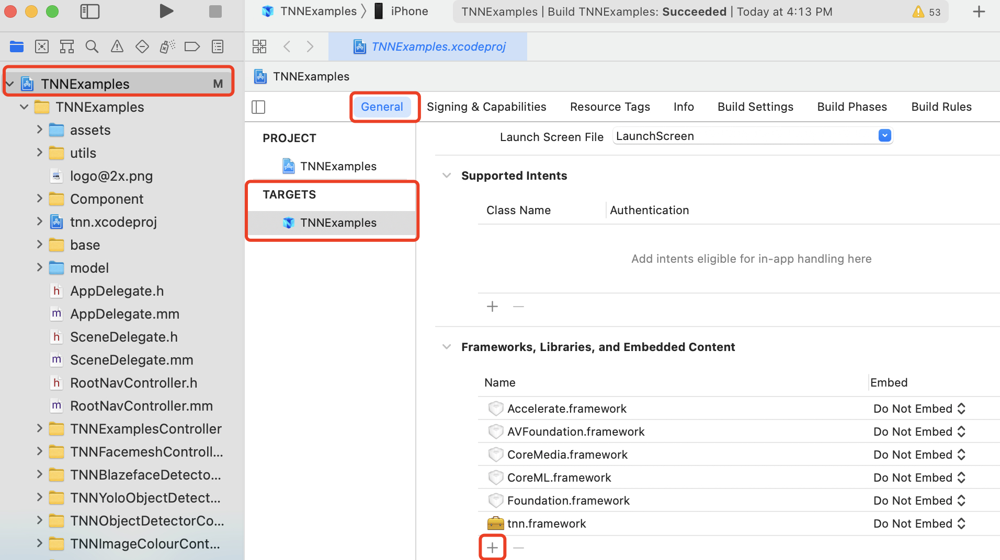
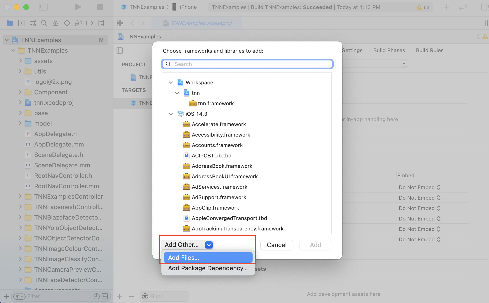
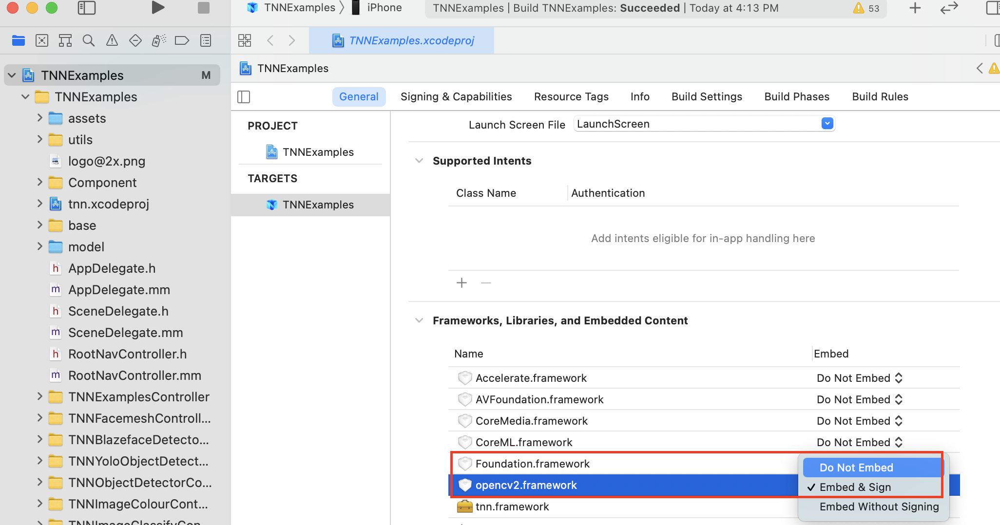
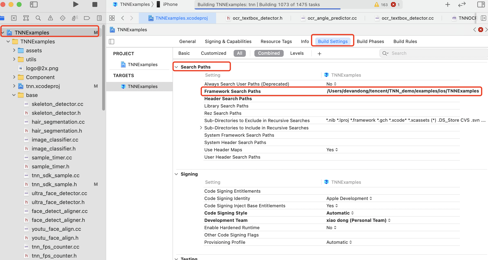

# Demo Introduction

[中文版本](../../cn/user/demo.md)

## I. Introduction to iOS Demo

### How to run

1. Download the Demo model

   ```
   cd <path_to_tnn>/model
   sh download_model.sh
   ```
   
   Optional: If you want to run the OCR demo, you also need to prepare the opencv framework. We provide a script to download opencv.
   ```
   cd <path_to_tnn>/scripts
   sh download_opencv.sh iOS
   ```
   
   PS: If the script cannot download the model or framework due to network problems, please manually create the corresponding folder according to the information in the script and download it by yourself. You can also download the models from AliYun Disk https://www.aliyundrive.com/s/MSmarP3zqrb 

2. Open the TNNExamples project

   Enter the directory `<path_to_tnn>/examples/ios/` and double-click to open the TNNExamples project.

   Optional: If you want to run the OCR demo, you also need to add opencv as dependency.

   Click the TNNExamples project as shown below, find the project setting `General`, click the `+` button under `Framworks, Libraries, and Embedded Content`.

   <div align=left >

   Choose `Add Other-Add Files...` in the following interface, find your `opencv2.framework` and add it. If you use the provided script, the downloaded opencv2.framework shoud be in the `<path_to_tnn>/third_party/opencv/iOS` directory.

   <div align=left >

   Due to the opencv2.framework includes code for real iOS devices and simulators, please set the `Embed` option to `Do Not Embed` as in the following interface.

   <div align=left >

   Finally, to ensure xcode can find the opencv2.framework, the directory containing the opencv2.framework must be added in the `Framework Search Paths`. As shown in the followng interface, find the project setting `Build Settings`,  then find the `Framework Search Paths` item under `Search Paths`. If the directory has not been included, double-click the item and add the directory.

   <div align=left >

3. Set up a developer account

   Click the TNNExamples project as shown below, find the project setting `Signing & Capabilities`, click the Team tab and select `Add an Account...`

  <div align=left>


   Enter the Apple ID account and password in the following interface. Return to the `Signing & Capabilities` interface, and select the added account in the Team tab. If you don’t have an Apple ID, you can also use the “Create Apple ID” option to apply according to the relevant prompts.

   `PS: There is no fee to apply for Apple ID, it can be passed immediately, and the APP can be run on the real machine after debugging.`

  <div align=left>


4. Run on real machine

   4.1 Modify `Bundle Identitifier`

   As shown in the figure, after the existing `Bundle Identifier`, a suffix (limited to numbers and letters) is randomly added to avoid personal account conflicts.

  <div align=left>

  4.2 Verify authorization
     
   For the first time, use the shortcut key `Command + Shift + K` to clean up the project, and then execute the shortcut key` Command + R` to run. If it is the first time to log in with Apple ID, Xcode will pop up a box and report the following error. You need to verify the authorization on the iOS device according to the prompt. Generally speaking, the authorization path on the phone is: Settings-> General-> Profile and Device Management-> Apple Development Options-> Click Trust
     

  <div align=left>

  4.3 Result
     
   For the first run, use the shortcut key `Command + Shift + K` to clean up the project, and then execute the shortcut key` Command + R` to run. Click the Run button on the interface, the interface will display the CPU and GPU time consumption of all models in the model directory. The running result of the iPhone7 real machine is shown below.
     
  PS:
     
  a) Due to the different GPU and CPU acceleration principles, the GPU performance of a specific model is not necessarily higher than that of the CPU. It is related to the specific model, model structure, and engineering implementation. Everyone is welcome to participate in the development of TNN and make progress together.
     
  b) The macro TNN_SDK_USE_NCNN_MODEL in TNNSDKSample.h defaults to 0, and the TNN model can be set to 1 to run the ncnn model.
     
     c) If you encounter an error message of `Unable to install...`, please delete the existing TNNExamples on the real device and run the installation again.
     
     d) If the CodeSign error `Command CodeSign failed with a nonzero exit code` is encountered when the real device is running, please refer to issue20 `iOS Demo Operation Step Instructions`

### Demo effect 

1. Face detection

   Model source: https://github.com/Linzaer/Ultra-Light-Fast-Generic-Face-Detector-1MB

   Effect example: iPhone 7, ARM single thread 6.3206ms

   <div align=left >

2. Image classification

   Model source: https://github.com/forresti/SqueezeNet

   Example: iPhone 7, ARM single thread 13.83ms

   <div align=left >

   
## II. Introduction to Android Demo
### Environment requirements

1. Android Studio 3.5 or above
2. NDK version >= 18, <= 21
NDK 22 and 23 are not suggested, because they may report error when link third party lib, eg. opencv, hiai.

### Steps

1. Download the Demo model

   ```
   cd <path_to_tnn>/model
   sh download_model.sh
   ```

   Optional: If you want to run the OCR demo, you also need to download opencv framework.
   ```
   cd <path_to_tnn>/scripts
   sh download_opencv.sh android
   ```

   PS: If the script cannot download the model due to network problems, please manually create the corresponding folder according to the information in the script and download it yourself. You can also download the models from AliYun Disk https://www.aliyundrive.com/s/MSmarP3zqrb 
  
   PS for Huawei NPU :
   You need to download the DDK before run the demo. Refer to： [FAQ](../faq_en.md): Huawei NPU Compilation Prerequisite.
 

2. Open the TNNExamples project

   - Enter the directory `<path_to_tnn>/examples/android/` and double-click to open the TNN example project file `build.gradle`.

   - Connect Android phone to compute, and click `Run Demo` to compile and run demo.

   - TNN example only build 64bit armv8 lib by default, if you need 32bit armv7 lib, please modify `build.gradle` with `abiFilters "armeabi-v7a", "arm64-v8a"`.
   
   PS for Huawei NPU ：
   
   1).  After opening the TNN example project，you need to set the TNN_HUAWEI_NPU_ENABLE switch to ON in <path_to_tnn>/examples/android/demo/CMakeList.txt below to use Huawei NPU ：
   
   ````
        set(TNN_HUAWEI_NPU_ENABLE ON CACHE BOOL "" FORCE)
   ````
      
   2). If encountering  `<path_to_tnn>/examples/android/src/main/jni/thirdparty/hiai_ddk/include/graph`Permission Denied，
   Clean Project and rerun.
  
   3). Only Huawei phones of rom version >= 100.320.xxx.xxxx supportS building the example TNN models.
  
   4). To run the demo, you need to first download the ddk. Refer to ： [FAQ](../faq_en.md) to check the current NPU support and how to update the ROM.

   5). You need to set the TNN_OPENCV_ENABLE switch to ON in <path_to_tnn>/examples/android/demo/CMakeList.txt below to run the OCR demo ：

   ````
        set(TNN_OPENCV_ENABLE ON CACHE BOOL "" FORCE)
   ````

   If you want to use specific OpenCV SDK instead of downloading through above `download_opencv.sh` script, you need to set OPENCV_ANDROID_SDK_PATH manually:
   In <path_to_tnn>/examples/android/demo/CMakeList.txt, change to specific OpenCV SDK path.
   ````
        set(OPENCV_ANDROID_SDK_PATH <path_to_opencv_android_sdk>)
   ````

### Running result
1. Face Detection-Pictures
   
   Model source: https://github.com/Linzaer/Ultra-Light-Fast-Generic-Face-Detector-1MB

   Effect example: Huawei P40, ARM single thread 32.2359ms

   <div align=left >
   
   
   Example： Huawei P40, NPU rom 100.320.010.022 9.04ms
       
   
<div align=left >
   
2. Face detection-video
   Model source: https://github.com/Linzaer/Ultra-Light-Fast-Generic-Face-Detector-1MB

   Effect example: Huawei P40, ARM single thread 122.296ms

   <div align=left >

   
    Example： Huawei P40, NPU rom 100.320.010.022 28ms
   
 <div align=left >
   
3. Image classification

   Model source: https://github.com/forresti/SqueezeNet

   Effect example: Huawei P40, ARM single thread 81.4047ms

   <div align=left >
   
   
   Example： Huawei P40, NPU rom 100.320.010.022 2.48ms
   
   <div align=left >
   
   
## III. Introduction to Linux/Mac/Windows/Armlinux/CudaLinux Demo

### Ability
* Demonstrate the calling method of TNN basic interface, quickly run the model in Linux/Mac/Windows/ArmLinux/CudaLinux environment.<br>
**Attention：demo sdk need to use the model recommended. Preprosess and Postprocesss may need to be modified with different model for type of different input and output.**

### Running Steps
#### 1. Downloand demo models
   ```
   cd <path_to_tnn>/model
   sh download_model.sh
   ```
   If the script cannot download the model due to network problems, please manually create the corresponding folder according to the information in the script and download it yourself. You can also download the models from AliYun Disk https://www.aliyundrive.com/s/MSmarP3zqrb 

#### 2. Compile Steps
##### Linux
* Environment Requirements  
   - Cmake (>=3.11)
   - OpenCV3 (only used by webcam demo), Can be imported in CMake by find_package(OpenCV 3)

   ```
   // Install OpenCV3 manually
   wget https://github.com/opencv/opencv/archive/3.4.13.zip
   unzip 3.4.13.zip
   cd opencv-3.4.13

   mkdir build
   mkdir install
   cd build

   cmake -DCMAKE_INSTALL_PREFIX=../install ..
   make -j4
   make install

   // add OpenCV path before find_package in CMakeList.txt
   // for example, move to examples/linux/x86, open CMakeList.txt
   // add the following before find_package(OpenCV 3 REQUIRED)
   set(OpenCV_DIR <path_to_opencv>/opencv-3.4.13/install/share/OpenCV)
   ```

* Compile  
   Move to `examples/linux/x86` directory and execute `build_linux_naitve.sh` or `build_linux_openvino.sh`. In the former case, TNN uses its optimized X86 backend to execute models, while the Intel OpenVINO backend is used in forward inference in the later case. Take `build_linux_native.sh` as an example, by default, only image demos will be compiled. If you want to compile the face alignmnt camera demo, you need to change the "-DTNN_DEMO_WITH_WEBCAM=OFF to "-DTNN_DEMO_WITH_WEBCAM=ON" in `build_linux_native.sh`:
   ```
   cd <path_to_tnn>/examples/linux/x86
   ./build_linux_naitve.sh
   ```
* Execute  
   Move to `examples/linux/x86/build_linux_native` or `examples/linux/x86/build_linux_openvino` directory, when execued without any parameters, demo executables will print usage message:
   ```
   cd build_linux_native
   ./demo_x86_imageclassify
   >Parameter -m and -p should be set 
   >usage:
   >./demo_x86_imageclassify [-h] [-p] tnnproto [-m] tnnmodel [-i] <input>
   >     -h, <help>      print a usage message.
   >     -p, <proto>     (required) tnn proto file path
   >     -m, <model>     (required) tnn model file path
   >     -i, <input>     (required) input file path
   >     -l, <label>     (optional) label file path. Default is: ../../../assets/synset.txt

   ```
   `-p` and `-m` are used for the tnnproto and tnnmodel file paths, respectively; `-i` is for specifying the classification label file path. `-h` option is for printing the usage message. Examples for executing each demo is shown below:
   ```
   cd build_linux_native
   
   image-classification demo
   ./demo_x86_imageclassify -p ../../../../model/SqueezeNet/squeezenet_v1.1.tnnproto -m ../../../../model/SqueezeNet/squeezenet_v1.1.tnnmodel -i ../../../assets/tiger_cat.jpg

   face-detector demo
   ./demo_x86_facedetector -p ../../../../model/face_detector/version-slim-320_simplified.tnnproto -m ../../../../model/face_detector/version-slim-320_simplified.tnnmodel -i ../../../assets/test_face.jpg

   object-detector demo
   ./demo_x86_objectdetector -p ../../../../model/yolov5/yolov5s.tnnproto -m ../../../../model/yolov5/yolov5s.tnnmodel -i ../../../assets/004545.jpg

   reading-comprehension demo
   ./demo_x86_readingcomprehension -p ../../../../model/bertsquad10/bertsquad10_clean.tnnproto -m ../../../../model/bertsquad10/bertsquad10_clean.tnnmodel -v ../../../../model/bertsquad10/vocab.txt

   pose-detector demo (Tencent Guangliu)
   ./demo_x86_posedetector -p ../../../../model/skeleton/skeleton_big.tnnproto -m ../../../../model/skeleton/skeleton.tnnmodel -i ../../../assets/skeleton_test.jpg

   pose-detector demo (blazepose)
   ./demo_x86_blazepose

   ocr-detector demo
   ./demo_x86_ocrdetecor

   face-alignment camera demo
   ./demo_x86_webcam
   ```

##### MacOS
* Environment Requirements  
   - Cmake (>=3.11)
   - OpenCV3 (only used by webcam demo), Can be imported in CMake by ```find_package(OpenCV 3)```. you can install opencv with brew (```brew install opencv@3 && brew link --force opencv@3```). If brew install failed, you can install opencv manually.

   ```
   // Install OpenCV3 manually
   wget https://github.com/opencv/opencv/archive/3.4.13.zip
   unzip 3.4.13.zip
   cd opencv-3.4.13

   mkdir build
   mkdir install
   cd build

   cmake -DCMAKE_INSTALL_PREFIX=../install ..
   make -j4
   make install

   // add OpenCV path before find_package in CMakeList.txt
   // for example, move to examples/linux/x86, open CMakeList.txt
   // add the following before find_package(OpenCV 3 REQUIRED)
   set(OpenCV_DIR <path_to_opencv>/opencv-3.4.13/install/share/OpenCV)
   ```

* Compile  
   Move to `examples/mac/x86` directory and execute `build_macos_native.sh` or `build_macos_openvino.sh`. In the former case, TNN uses its optimized X86 backend to execute models, while the Intel OpenVINO backend is used in forward inference in the later case. Take `build_macos_native.sh` as an example, by default, only image demos will be compiled. If you want to compile the face alignmnt camera demo, you need to change the "-DTNN_DEMO_WITH_WEBCAM=OFF to "-DTNN_DEMO_WITH_WEBCAM=ON" in `build_macos_native.sh`:
   ```
   cd <path_to_tnn>/examples/mac/x86
   ./build_macos_native.sh
   ```
* Execute  
   Move to `examples/mac/x86/build_macos_native` or `examples/mac/x86/build_macos_openvino` directory, when execued without any parameters, demo executables will print usage message:
   ```
   cd build_macos_native
   ./demo_x86_imageclassify
   >Parameter -m and -p should be set 
   >usage:
   >./demo_x86_imageclassify [-h] [-p] tnnproto [-m] tnnmodel [-i] <input>
   >     -h, <help>      print a usage message.
   >     -p, <proto>     (required) tnn proto file path
   >     -m, <model>     (required) tnn model file path
   >     -i, <input>     (required) input file path
   >     -l, <label>     (optional) label file path. Default is: ../../../assets/synset.txt

   ```
   `-p` and `-m` are used for the tnnproto and tnnmodel file paths, respectively; `-i` is for specifying the classification label file path. `-h` option is for printing the usage message. Examples for executing each demo is shown below:
   ```
   cd build_macos_native
   
   image-classification demo
   ./demo_x86_imageclassify -p ../../../../model/SqueezeNet/squeezenet_v1.1.tnnproto -m ../../../../model/SqueezeNet/squeezenet_v1.1.tnnmodel -i ../../../assets/tiger_cat.jpg

   face-detector demo
   ./demo_x86_facedetector -p ../../../../model/face_detector/version-slim-320_simplified.tnnproto -m ../../../../model/face_detector/version-slim-320_simplified.tnnmodel -i ../../../assets/test_face.jpg

   object-detector demo
   ./demo_x86_objectdetector -p ../../../../model/yolov5/yolov5s.tnnproto -m ../../../../model/yolov5/yolov5s.tnnmodel -i ../../../assets/004545.jpg

   reading-comprehension demo
   ./demo_x86_readingcomprehension -p ../../../../model/bertsquad10/bertsquad10_clean.tnnproto -m ../../../../model/bertsquad10/bertsquad10_clean.tnnmodel -v ../../../../model/bertsquad10/vocab.txt

   pose-detector demo (Tencent Guangliu)
   ./demo_x86_posedetector -p ../../../../model/skeleton/skeleton_big.tnnproto -m ../../../../model/skeleton/skeleton.tnnmodel -i ../../../assets/skeleton_test.jpg

   pose-detector demo (blazepose)
   ./demo_x86_blazepose

   ocr-detector demo
   ./demo_x86_ocrdetecor

   face-alignment camera demo
   ./demo_x86_webcam
   ```

##### Windows
* Environment Requirements  
   - Visual Studio (>=2017)
   - Cmake (>=3.11; Or run scripts with Visual Studio Prompt)
   - OpenCV3, compiled by the same version of VC.
* Comiple  
   Open `x64 Native Tools Command Prompt for VS 2017/2019`.
   Move to `examples\windows\x86` directory and execute `build_msvc_native.bat` or `build_msvc_openvino.bat`. In the former case, TNN uses its optimized X86 backend to execute models, while the Intel OpenVINO backend is used in forward inference in the later case. Take `build_msvc_native.bat` as an example, by default, only image demos will be compiled. If you want to compile the face alignmnt camera demo, you need to change the "-DTNN_DEMO_WITH_WEBCAM=OFF to "-DTNN_DEMO_WITH_WEBCAM=ON" in `build_msvc_native.bat`:
   ```
   set OpenCV_DIR=`OPENCV_INSTALL_DIR`
   cd <path_to_tnn>\examples\windows\x86
   .\build_msvc_native.bat
   ```
* Execute  
   Move to `examples\windows\x86\build_msvc_native\release` or `examples\windows\x86\build_msvc_openvino\release` directory, when execued without any parameters, demo executables will print usage message:
   ```
   cd build_msvc_native\release
   .\demo_x86_imageclassify
   >Parameter -m and -p should be set 
   >usage:
   >.\demo_x86_imageclassify [-h] [-p] tnnproto [-m] tnnmodel [-i] <input>
   >     -h, <help>      print a usage message.
   >     -p, <proto>     (required) tnn proto file path
   >     -m, <model>     (required) tnn model file path
   >     -i, <input>     (required) input file path
   >     -l, <label>     (optional) label file path. Default is: ../../../assets/synset.txt
   ```
   `-p` and `-m` are used for the tnnproto and tnnmodel file paths, respectively; `-i` is for specifying the classification label file path. `-h` option is for printing the usage message. Examples for executing each demo is shown below:
   ```
   cd build_msvc_native\release

   image-classification demo
   .\demo_x86_imageclassify -p ..\..\..\..\..\model\SqueezeNet\squeezenet_v1.1.tnnproto -m ..\..\..\..\..\model\SqueezeNet\squeezenet_v1.1.tnnmodel -i ..\..\..\..\assets\tiger_cat.jpg

   face-detector demo
   .\demo_x86_facedetector -p ..\..\..\..\..\model\face_detector\version-slim-320_simplified.tnnproto -m ..\..\..\..\..\model\face_detector\version-slim-320_simplified.tnnmodel -i ..\..\..\..\assets\test_face.jpg

   object-detector demo
   .\demo_x86_objectdetector -p ..\..\..\..\model\mobilenet_v2-ssd\mobilenetv2_ssd_tf.tnnproto -m ..\..\..\..\model\mobilenet_v2-ssd\mobilenetv2_ssd_tf.tnnmodel -i ..\..\..\assets\004545.jpg

   reading-comprehension demo
   .\demo_x86_readingcomprehension -p ..\..\..\..\..\model\bertsquad10\bertsquad10_clean.tnnproto -m ..\..\..\..\..\model\bertsquad10\bertsquad10_clean.tnnmodel -v ..\..\..\..\..\model\bertsquad10\vocab.txt

   pose-detector demo (Tencent Guangliu)
   .\demo_x86_posedetector -p ..\..\..\..\model\skeleton\skeleton_big.tnnproto -m ..\..\..\..\model\skeleton\skeleton.tnnmodel -i ..\..\..\assets\skeleton_test.jpg

   pose-detector demo (blazepose)
   .\demo_x86_blazepose

   ocr-detector demo
   .\demo_x86_ocrdetecor

   webcam base face alignment demo
   .\demo_x86_webcam
   ```

##### ArmLinux
* Environment Requirements  
   - Cmake (>=3.1)
   - Install arm toolchain
   - ubuntu:  
      aarch64: sudo apt-get install g++-aarch64-linux-gnu  gcc-aarch64-linux-gnu  
      arm32hf: sudo apt-get install g++-arm-linux-gnueabihf gcc-arm-linux-gnueabihf
  - other linux: download toolchains from https://developer.arm.com/tools-and-software/open-source-software/developer-tools/gnu-toolchain/gnu-a/downloads
* Comiple  
   Move to `examples/linux/cross` directory:
   ```
   cd <path_to_tnn>/examples/linux/cross
   ```
   Modify `build_aarch64_linux.sh` or `build_armhf_linux.sh`，take aarch64 as an example, modify building options:
   ```
   CC=aarch64-linux-gnu-gcc
   CXX=aarch64-linux-gnu-g++
   TNN_LIB_PATH=../../../scripts/build_aarch64_linux/
   ```
   execute `build_aarch64_linux.sh`
   ```
   sh build_aarch64_linux.sh
   ```
* Execute  
   Move to `examples/linux/cross/build` directory, when execued without any parameters, demo executables will print usage message:
    ```
   cd build
   ./demo_arm_linux_imageclassify
   >Parameter -m and -p should be set 
   >usage:
   >./demo_arm_linux_imageclassify [-h] [-p] tnnproto [-m] tnnmodel [-i] <input>
   >     -h, <help>      print a usage message.
   >     -p, <proto>     (required) tnn proto file path
   >     -m, <model>     (required) tnn model file path
   >     -i, <input>     (required) input file path
   >     -l, <label>     (optional) label file path. Default is: ../../../assets/synset.txt
   ```
   `-p` and `-m` are used for the tnnproto and tnnmodel file paths, respectively; `-i` is for specifying the classification label file path. `-h` option is for printing the usage message. Examples for executing each demo is shown below:
   ```
   cd build

   image-classification demo
   ./demo_arm_linux_imageclassify -p ../../../../model/SqueezeNet/squeezenet_v1.1.tnnproto -m ../../../../model/SqueezeNet/squeezenet_v1.1.tnnmodel -i ../../../assets/tiger_cat.jpg

   face-detector demo
   ./demo_arm_linux_facedetector -p ../../../../model/face_detector/version-slim-320_simplified.tnnproto -m ../../../../model/face_detector/version-slim-320_simplified.tnnmodel -i ../../../assets/test_face.jpg

   reading-comprehension demo
   ./demo_arm_linux_readingcomprehension -p ../../../../model/bertsquad10/bertsquad10_clean.tnnproto -m ../../../../model/bertsquad10/bertsquad10_clean.tnnmodel -v ../../../../model/bertsquad10/vocab.txt
   ```

##### CudaLinux
* Environment Requirements
   - Cmake (>= 3.8)
   - CUDA (>= 10.2)
   - TensorRT (>= 7.1)
* Compile
   Configure the TensorRT path in env
   ```
   export TENSORRT_ROOT_DIR=<TensorRT_path>
   ```
   Configure the CuDNN path in env
   ```
   export CUDNN_ROOT_DIR=<CuDNN_path>
   ```
   Move to `examples/linux/cuda` directory and execute `build_linux.sh` :
   ```
   cd <path_to_tnn>/examples/linux/cuda
   sh build_linux.sh
   ```
* Execute
    Move to `examples/linux/cuda/build_cuda_linux` directory, when execued without any parameters, demo executables will print usage message:
    ```
   cd build_cuda_linux
   ./demo_cuda_imageclassify
   >Parameter -m and -p should be set 
   >usage:
   >./demo_cuda_imageclassify [-h] [-p] tnnproto [-m] tnnmodel [-i] <input>
   >     -h, <help>      print a usage message.
   >     -p, <proto>     (required) tnn proto file path
   >     -m, <model>     (required) tnn model file path
   >     -i, <input>     (required) input file path
   >     -l, <label>     (optional) label file path. Default is: ../../../assets/synset.txt
   ```
   `-p` and `-m` are used for the tnnproto and tnnmodel file paths, respectively; `-i` is for specifying the classification label file path. `-h` option is for printing the usage message. Examples for executing each demo is shown below:
   ```
   cd build_cuda_linux

   image-classification demo
   ./demo_cuda_imageclassify -p ../../../../model/SqueezeNet/squeezenet_v1.1.tnnproto -m ../../../../model/SqueezeNet/squeezenet_v1.1.tnnmodel -i ../../../assets/tiger_cat.jpg

   face-detector demo
   ./demo_cuda_facedetector -p ../../../../model/face_detector/version-slim-320_simplified.tnnproto -m ../../../../model/face_detector/version-slim-320_simplified.tnnmodel -i ../../../assets/test_face.jpg

   object-detector demo
   ./demo_cuda_objectdetector -p ../../../../model/yolov5/yolov5s.tnnproto -m ../../../../model/yolov5/yolov5s.tnnmodel -i ../../../assets/004545.jpg

   reading-comprehension demo
   ./demo_cuda_readingcomprehension -p ../../../../model/bertsquad10/bertsquad10_clean.tnnproto -m ../../../../model/bertsquad10/bertsquad10_clean.tnnmodel -v ../../../../model/bertsquad10/vocab.txt

   pose-detector demo (Tencent Guangliu)
   ./demo_cuda_posedetector -p ../../../../model/skeleton/skeleton_big.tnnproto -m ../../../../model/skeleton/skeleton.tnnmodel -i ../../../assets/skeleton_test.jpg

   pose-detector demo (blazepose)
   ./demo_cuda_blazepose

   ocr-detector demo
   ./demo_cuda_ocrdetecor
   ```
### FAQ

#### Demo Execution Questions
1. Demo execution error: "open file xxx failed"

   This error indicates invalid input image file path. Please check input the input image path.

2. Demo execution error: "open lable file xxx failed"

   This error indicates invalid classification label path. The image-classify demo requires predefined label file, and the default label file is located at: `<path_to_tnn>/examples/assets/synset.txt`.

#### CUDA Compilation Questions
1. Compilation Error: "not defined environment variable:CUDNN_ROOT_DIR"或"not defined environment variable:TENSORRT_ROOT_DIR"
   Please follow the CUDA compilation steps and check if the env `CUDNN_ROOT_DIR` and `TENSORRT_ROOT_DIR` are set properly.

### Function process
#### Image classification function process
* Create predictor:  
   ```cpp
   auto predictor = std::make_shared<ImageClassifier>();
   ```
* Init predictor:  
   ```cpp
   CHECK_TNN_STATUS(predictor->Init(option));
   // for Linux/Windows(X86 native / OPENVINO)
   option->compute_units = TNN_NS::TNNComputeUnitsCPU;
   // for ArmLinux
   option->compute_units = TNN_NS::TNNComputeUnitsCPU;
   // for CUDA
   option->compute_units = TNN_NS::TNNComputeUnitsGPU;
   ```
* Create image_mat:  
   ```cpp
   // for Linux/Windows(OpenVINO)
   auto image_mat = std::make_shared<TNN_NS::Mat>(TNN_NS::DEVICE_X86, TNN_NS::N8UC3, nchw, data);
   // for Linux/Windows(X86 native)
   auto image_mat = std::make_shared<TNN_NS::Mat>(TNN_NS::DEVICE_NAIVE, TNN_NS::N8UC3, nchw, data);
   // for ArmLinux
   auto image_mat = std::make_shared<TNN_NS::Mat>(TNN_NS::DEVICE_ARM, TNN_NS::N8UC3, nchw, data);
   // for CUDA
   auto image_mat = std::make_shared<TNN_NS::Mat>(TNN_NS::DEVICE_NAIVE, TNN_NS::N8UC3, nchw, data);
   ```
* Run predictor:  
   ```cpp
   CHECK_TNN_STATUS(predictor->Predict(std::make_shared<TNNSDKInput>(image_mat), sdk_output));
   ```
#### Face detection function process
* Create predictor:  
   ```cpp
   auto predictor = std::make_shared<UltraFaceDetector>();
   ```
* Init predictor:  
   ```cpp
   CHECK_TNN_STATUS(predictor->Init(option));
   // for Linux/Windows(X86 native / OPENVINO)
   option->compute_units = TNN_NS::TNNComputeUnitsCPU;
   // for ArmLinux
   option->compute_units = TNN_NS::TNNComputeUnitsCPU;
   // for CUDA
   option->compute_units = TNN_NS::TNNComputeUnitsGPU;
   ```
* Create image_mat:  
   ```cpp
   // for Linux/Window(OpenVINO)
   auto image_mat = std::make_shared<TNN_NS::Mat>(TNN_NS::DEVICE_X86, TNN_NS::N8UC3, nchw, data);
   // for Linux/Windows(X86 native)
   auto image_mat = std::make_shared<TNN_NS::Mat>(TNN_NS::DEVICE_NAIVE, TNN_NS::N8UC3, nchw, data);
   // for ArmLinux
   auto image_mat = std::make_shared<TNN_NS::Mat>(TNN_NS::DEVICE_ARM, TNN_NS::N8UC3, nchw, data);
   // for CUDA
   auto image_mat = std::make_shared<TNN_NS::Mat>(TNN_NS::DEVICE_NAIVE, TNN_NS::N8UC3, nchw, data);
   ```
* Run predictor:  
   ```cpp
   CHECK_TNN_STATUS(predictor->Predict(std::make_shared<UltraFaceDetectorInput>(image_mat), sdk_output));
   ```
* Mark face:  
   ```cpp
   TNN_NS::Rectangle((void *)ifm_buf, image_orig_height, image_orig_width, face.x1, face.y1, face.x2, face.y2, scale_x, scale_y);
   ```


## IV. NCNN model usage and interface introduction

- [NCNN related](./ncnn_en.md)


