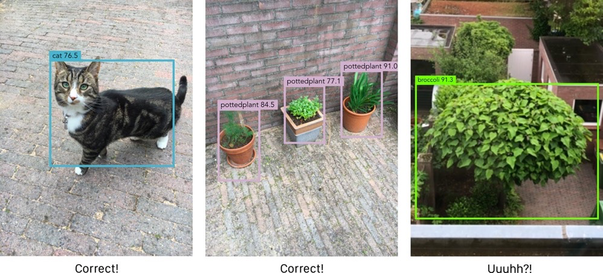
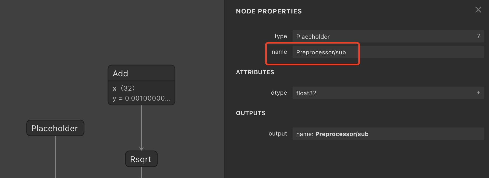
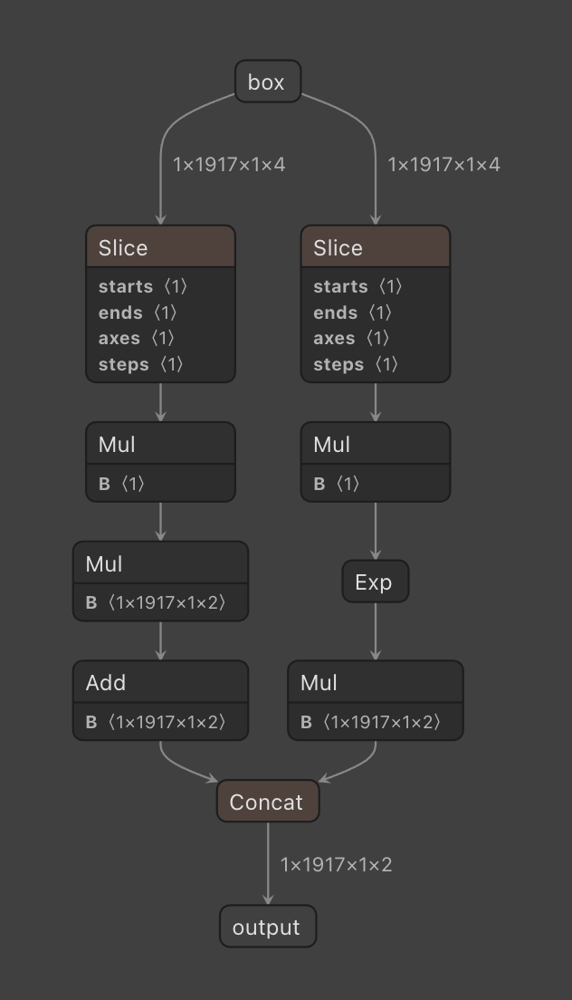
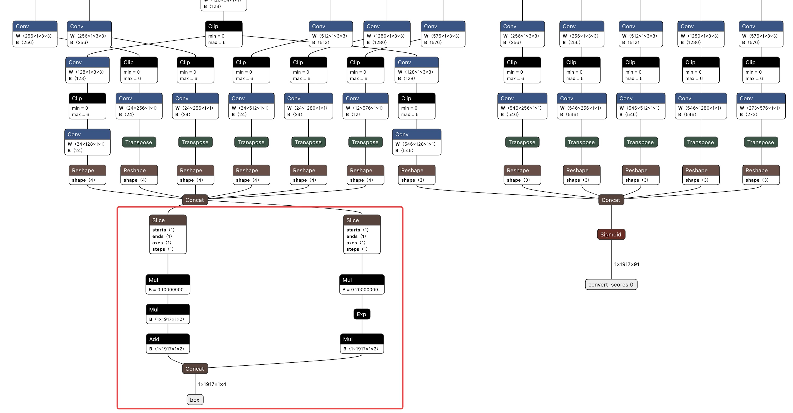
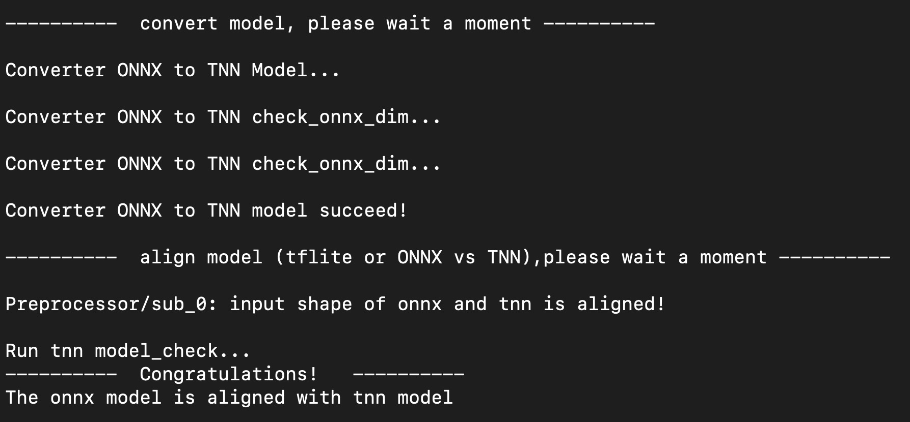
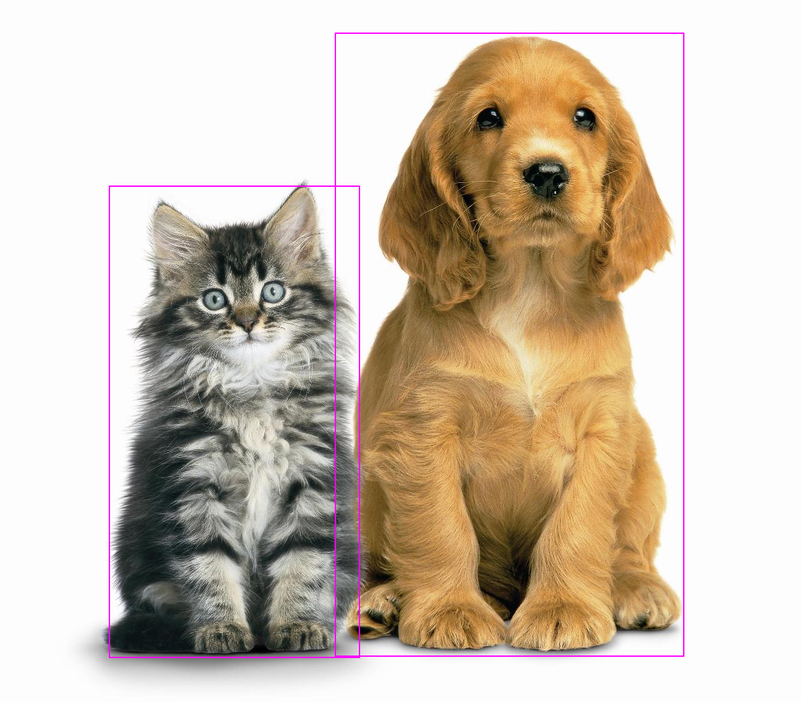

[English Version](./ssd_conversion_and_deployment_en.md)

# 基于 SSD 的 TNN 模型转换和部署

## 一、 前言

SSD 是一种足够快的目标检测算法，它可以用于实时视频的检测。SSD 算法可以找到图像中不同类别物体的位置，并使用边界框来描述被检测物体的位置。对于每一个边界框，SSD 模型都会对框内物体的类别进行预测。

在部署过程中，目标检测算法往往需要复杂繁琐的后处理。这篇文章将介绍如何将SSD 的 TensorFlow 模型通过转换和处理，将后处理集成到模型中，并利用 TNN 进行部署的过程。


## 二、 TensorFlow 模型下载与清理

SSD 模型有很多不同的变体，为了获得足够快的速度，这篇文章中将使用含有深度可分离卷积的 MobileNet V2 来作为算法的主干网络。我们使用 TensorFlow 训练好的 ssdlite_mobilenet_v2_coco 进行转换，你可以[在这里下载](http://download.tensorflow.org/models/object_detection/ssdlite_mobilenet_v2_coco_2018_05_09.tar.gz) 。

下载得到的模型是通过 TensorFlow Object Detection API 训练得到的。下载并解压完成之后，ssdlite_mobilenet_v2_coco 模型的文件夹里包含了 frozen graph，checkpoint 以及 SavedModel。在后续的模型转换过程中，所需要的模型文件是 frozen graph，但是其中含有 loop 这样的算子，其在 TNN 中是不支持的。为了避免后续的转换出现问题，我们需要将其从模型中去除。首先，我们加载模型，

``` python3
import onnx
import torch
import numpy as np
import tensorflow as tf
from tensorflow.python.tools import strip_unused_lib
from tensorflow.python.framework import dtypes
from tensorflow.python.framework.graph_util import convert_variables_to_constants
from tensorflow.python.platform import gfile

def load_saved_model(path):
    the_graph = tf.Graph()
    with tf.Session(graph=the_graph) as sess:
        tf.saved_model.loader.load(sess, [tf.saved_model.tag_constants.SERVING], path)
    return the_graph

saved_model_path = "ssdlite_mobilenet_v2_coco_2018_05_09/saved_model"

the_graph = load_saved_model(saved_model_path)
```

加载完成的模型以 TensorFlow graph 对象的形式存放在 the_graph 中。

然后我们需要借助 TensorFlow 提供的工具—— strip_unused 函数进行子图切分，去除掉无用的子图，保留我们需要的子图：

``` python3
input_node = "Preprocessor/sub"
bbox_output_node = "concat"
class_output_node = "Postprocessor/convert_scores"

def optimize_graph(graph):
    gdef = strip_unused_lib.strip_unused(
        input_graph_def=graph.as_graph_def(),
        input_node_names=[input_node],
        output_node_names=[bbox_output_node, class_output_node],
        placeholder_type_enum=dtypes.float32.as_datatype_enum)

    return gdef

opt_gdef = optimize_graph(the_graph)
```

在调用 strip_unused 函数之后，新得到的图只会保留原图中指定输入节点和输出节点之间的内容，其余部份的子图在新的图中都不会被保留。

我们得到新的图中，含有一个输入和两个输出，这两个输出分别是用来预测边界框的坐标以及物体的类别。

如果想要查看新得到图的结构，可以使用如下代码将其保存在名为 saved_model.pb 的文件中，并使用 [Netron](https://github.com/lutzroeder/netron) 可视化之后查看。

``` python3
with gfile.GFile("saved_model.pb", "wb") as f:
    f.write(opt_gdef.SerializeToString())
```

这一部分中，所有使用到的代码被存放在了[这里](../code/part2_clean_tensorflow_model.py) 。


## 三、 TensorFlow 模型转 ONNX 模型

通过之前的修改，我们得到了新的 TensorFlow 模型。为了方便部署和把新的 TensorFlow 模型转换成 TNN 模型，我们需要先把 TensorFlow 模型转换成 ONNX 模型，再向 ONNX 模型中添加边界框解码，最后再将 ONNX 模型转换为 TNN 模型。

从 TensorFlow 模型到 ONNX 模型的转换，我们借助开源的转换工具 tf2onnx 来完成。在开始转换之前，我们需要先安装 tf2onnx，

``` shell
pip3 install tf2onnx
```

注意，tf2onnx 的版本需要不低于 1.5.5 。

tf2onnx 安装完成后，可以使用如下转换命令将 TensorFlow 模型转换为 ONNX 模型,

``` shell
python3 -m tf2onnx.convert  \
  --graphdef saved_model.pb \
  --inputs "Preprocessor/sub:0[1,300,300,3]" \
  --inputs-as-nchw "Preprocessor/sub:0" \
  --outputs "Postprocessor/convert_scores:0,concat:0" \
  --output saved_model.onnx \
  --opset 11 \
  --fold_const
```

在上述命令中，通过 --graphdef 来指定待转换的 TensorFlow 模型路径； --inputs 用来指定模型的输入名称以及输入 shape，输入名称可以通过 Netron 可视化 TensorFlow 模型之后得到，下图就是通过 Netron 可视化得到的输入信息，

<div align=center > 

<div align=left >

在 ssdlite_mobilenet_v2_coco 目录下，有文件 pipeline.config，我们从中可以找到 SSD 模型输入的图像分辨率是 300x300，因此输入的 shape 是 [1,300,300,3]。注意，TensorFlow 模型输入的数据排布是 NHWC 类型的。

另外需要注意的是在 input 名称的后面往往需要添加一个 :0，例如这个模型的 --inputs 传入的参数可以用 input:0[1,300,300,3]；--outputs 是用来指定输出名称，并不需要指定输出的 shape，其获取方法和注意事项与 --inputs 基本相同。

更多参数信息可以参考 tf2onnx 的官方文档，tf2onnx 的项目地址是 https://github.com/onnx/tensorflow-onnx 。

在这一部分使用到的 shell 脚本被放在了[这里](../code/part3_convert_tensorflow_to_onnx.sh)。

## 四、 ONNX 模型输入输出名称修改

在使用 tf2onnx 转换得到 onnx 模型之后，我们已经可以开始后处理操作集成到模型中。但是，onnx 模型的输入名称是 Preprocessor/sub:0，输出名称是 Postprocessor/convert_scores:0 和 concat:0，这样的名称缺乏语义信息，让人不容易理解，也不便于后续操作。因此，我们对输入名称和输出名称做一些修改，把输入名称替换为 input，输出名称替换为 score 和 box。这样的名称直观简洁，也方便后续使用。

模型输入输出名称的修改可以分为两步，第一步是遍历模型中所有的输入（或输出）将其进行修改，第二步是遍历模型中的所有节点，修改所有使用过该输入（或输出）的节点。

``` python3
onnx_model = onnx.load("saved_model.onnx")

def modify_input_name(model, src_name, dst_name):
    for i in range(len(onnx_model.graph.input)):
        if onnx_model.graph.input[i].name == src_name:
            onnx_model.graph.input[i].name = dst_name
    for i in range(len(onnx_model.graph.node)):
        for j in range(len(onnx_model.graph.node[i].input)):
            if onnx_model.graph.node[i].input[j] == src_name:
                onnx_model.graph.node[i].input[j] = dst_name

    return model

def modify_output_name(model, src_name, dst_name):
    for i in range(len(onnx_model.graph.output)):
        if onnx_model.graph.output[i].name == src_name:
            onnx_model.graph.output[i].name = dst_name
    for i in range(len(onnx_model.graph.node)):
        for j in range(len(onnx_model.graph.node[i].output)):
            if onnx_model.graph.node[i].output[j] == src_name:
                onnx_model.graph.node[i].output[j] = dst_name

    return model

modify_input_name(onnx_model, "Preprocessor/sub:0", "input")
modify_output_name(onnx_model, "Postprocessor/convert_scores:0", "score")
modify_output_name(onnx_model, "concat:0", "box")

onnx.save(onnx_model, "saved_model_modify.onnx")
```

这样，我们就得到了输入输出名称修改完成的 onnx 模型，并将它保存为 saved_model_modify.onnx 。接下来就可以将边界解码这样的后处理操作添加到模型中。

修改模型输入输出名称的代码放在了[这里](../code/part4_fix_onnx_input_and_output.py) 。

## 五、 ONNX 模型添加边界框解码

在 SSD 模型中，最后输出的边界框并不是真实的坐标。为了更好地适应目标多变的形状，SSD 使用了 Anchor 框，模型最后的输出是基于 Anchor 框的偏移量。换句话说，需要把 SSD 的输出和 Anchor 框一起进行解码之后，才可以得到最终预测的边界框坐标。

下面的公式描述了如何通过 SSD 的输出和 Anchor 框得到最终预测的边界框，

``` text
x = (tx / 10) * aw + ax
y = (ty / 10) * ah + ay
w = exp(tw / 5) * aw
h = exp(th / 5) * ah
```

其中，tx, ty, tw, th 是 SSD 的预测结果，ax, ay, aw, ah是 Anchor 框坐标，x, y, w, h 是最终的边界框坐标。

以最终的边界框坐标为例，x, y 用来表示框的中心坐标，w, h 用来表示框的长和宽，其余坐标的含义与边界框坐标的含义类似。

对于 Anchor 框，其实，我们并不需要关心它的具体坐标，因为它是一个超参数，在训练之前就已经确定了，而且在整个过程中都是固定的。这篇文章提供了保存有 Anchor 框坐标的文件，后续我们使用 Anchor 框进行解码，只需要点击[这里](https://drive.weixin.qq.com/s?k=AJEAIQdfAAoVU0puc8) 下载即可。

在前面的部份，我们已经把 SSD 模型从 TensorFlow 转换为 ONNX 模型。 为了方便模型使用，接下来，需要以解码公式为基础，将解码添加到 SSD 模型中。

为了把解码添加到 SSD 模型中，我们借助 ONNX 提供的 Python API 构建边界框解码模型，然后拼接 SSD 模型和边界框解码模型得到完整的模型。

### 1. 构建边界框解码 ONNX 模型

分析上述的公式，可以发现在边界框解码的过程中主要使用到以下几种操作，

+ 切片 (slice)：x, y, w, h 这四种边界框信息都包含在同一个 Tensor 中，在后续解码之前，需要将输出 Tensor 进行切片，得到不同的坐标，便于后续解码

+ 乘法 (mul)：用于边界框解码

+ 加法 (add)：用于边界框解码

+ 指数 (exp)：用于边界框解码

+ 拼接 (concat)：用于将解码后的信息拼接为一个完整的 Tensor

接下来我们利用 ONNX 的 Python API 来构建这五种算子，

``` python3
def create_slice_node(name: str, start: list, end: list, axes: list, step: list, input_name: str, output_shape: list):
    param_dict = {"start": start, "end": end, "axes": axes, "step": step}
    inputs_name = [input_name]
    initializer_list = []
    for suffix, param in param_dict.items():
        initializer_name = "{}_{}".format(name, suffix)
        value = np.array(param, dtype=np.int64)
        initializer = helper.make_tensor(initializer_name, onnx.mapping.NP_TYPE_TO_TENSOR_TYPE[value.dtype],
                                         value.shape, value)
        inputs_name.append(initializer_name)
        initializer_list.append(initializer)

    output = helper.make_tensor_value_info(name, TensorProto.FLOAT, output_shape)
    slice_def = helper.make_node(op_type="Slice", inputs=inputs_name, outputs=[name])

    return slice_def, initializer_list, [output, ]

def create_mul_node(name: str, input_name: str, output_shape: list, weights=None):
    initializer_name = "{}_{}".format(name, "weights")
    data_type = weights.dtype if type(weights) is np.ndarray else np.dtype(np.float32)
    shape = weights.shape if type(weights) is np.ndarray else (len(weights),)
    value = list(weights.reshape(-1, )) if type(weights) is np.ndarray else weights
    initializer = helper.make_tensor(initializer_name, onnx.mapping.NP_TYPE_TO_TENSOR_TYPE[data_type], shape, value)
    output = helper.make_tensor_value_info(name, TensorProto.FLOAT, output_shape)
    mul_def = helper.make_node(op_type="Mul", inputs=[input_name, initializer_name], outputs=[name])

    return mul_def, [initializer, ], [output, ]

def create_add_node(name: str, input_name: str, output_shape: list, weights=None):
    initializer_name = "{}_{}".format(name, "weights")
    data_type = weights.dtype if type(weights) is np.ndarray else np.dtype(np.float32)
    shape = weights.shape if type(weights) is np.ndarray else (len(weights),)
    value = list(weights.reshape(-1, )) if type(weights) is np.ndarray else weights
    initializer = helper.make_tensor(initializer_name, onnx.mapping.NP_TYPE_TO_TENSOR_TYPE[data_type], shape, value)
    output = helper.make_tensor_value_info(name, TensorProto.FLOAT, output_shape)
    add_def = helper.make_node(op_type="Add", inputs=[input_name, initializer_name], outputs=[name])

    return add_def, [initializer, ], [output, ]

def create_exp_node(name: str, input_name: str, output_shape: list):
    output = helper.make_tensor_value_info(name, TensorProto.FLOAT, output_shape)
    exp_def = helper.make_node(op_type="Exp", inputs=[input_name, ], outputs=[name])

    return exp_def, [output, ]

def create_concat_node(name: str, axis: int, inputs_name, output_shape: list):
    output = helper.make_tensor_value_info(name, TensorProto.FLOAT, output_shape)
    concat_def = helper.make_node(op_type="Concat", inputs=inputs_name, outputs=[name], axis=axis)

    return concat_def, [output, ]
```

将算子的构建过程包装完成之后，我们就可以依据边界框解码公式来构建解码模型了。

在 SSD 模型中，有两个输出 score 和 box，边界框解码模型是对 box 进行解码计算，因此我们将 box 作为边界框解码模型的输入即可，

``` python3
box = helper.make_tensor_value_info('box', TensorProto.FLOAT, [1, 1917, 1, 4])
```

上面的代码创建了一个 box 变量用于描述边界框解码模型的输入，这个输入的名称叫 box，类型是 FLOAT，shape 是 [1, 1917, 1, 4]。

观察公式中的计算计算可以发现，解码的操作分为两类，一类是 y 和 x，除以 10 之后和利用对应的 Anchor 数据做线性变换，另一类是 h 和 w，除以 5 之后求指数再乘以对应的 Anchor 数据。因此，我们无需将输入 Tensor 切分为 x，y，h，w 四个部分，只需要利用 slice 算子对输入的 Tensor 做切片，将其切分为 yx 和 hw 两部分即可，

``` python3
slice_yx, slice_yx_ini, slice_yx_output = create_slice_node("slice_yx", [0], [2], [3], [1], box.name, [1, 1917, 1, 2])
slice_hw, slice_hw_ini, slice_hw_output = create_slice_node("slice_hw", [2], [4], [3], [1], box.name, [1, 1917, 1, 2])
```

切片的过程中，我们在 axis=3 这个维度将 Tensor 平均的分为两份，一份表示 yx，另一份 表示 hw。在这里有一个点需要特别注意，SSD 模型 box 这个输出中，数据是按照 y, x, h, w 的顺序排列的，因此第一份数据是 yx 而不是 xy。

接下来，我们先对 yx 进行解码操作。因为除法在推理的过程中，会更加耗时，我们将其用乘法等效替代，

``` python3
yx_mul_const, yx_mul_const_ini, yx_mul_const_output = create_mul_node("yx_mul_const", "slice_yx", [1, 1917, 1, 2],  [0.1])
```

完成除法计算之后，我们需要利用 Anchor 数据进行线性变换。在前面的部分，我们已经下载好了 Anchor 数据，现在我们把它读取到内存中，

``` python3
anchor_yx = np.load("anchor_data/anchor_yx.npy")
anchor_hw = np.load("anchor_data/anchor_hw.npy")
```

保存在 npy 文件中 Anchor 数据的 shape 是 [2, 1917, 1]，这和解码数据的维度是不相匹配的，我们利用 numpy 的 transpose 和 expand_dims 对 Anchor 数据进行变换，使其变成 [1, 1917, 1, 2]，和解码数据相匹配，

``` python3
anchor_yx = np.expand_dims(anchor_yx.transpose((1, 2, 0)), axis=0)
anchor_hw = np.expand_dims(anchor_hw.transpose((1, 2, 0)), axis=0)
```

有了 Anchor 数据之后，我们就可以根据公式进行线性变换了，

``` python3
yx_mul_anchor_hw, yx_mul_anchor_hw_ini, yx_mul_anchor_hw_output = create_mul_node("yx_mul_anchor_hw", "yx_mul_const", [1, 1917, 1, 2], anchor_hw)
yx_add_anchor_yx, yx_add_anchor_yx_ini, yx_add_anchor_yx_output = create_add_node("yx_add_anchor_yx", "yx_mul_anchor_hw", [1, 1917, 1, 2], anchor_yx)
```

这样就完成了 yx 部分的解码，然后再进行 hw 部分的解码。在这部分中，我们同样使用乘法来对乘法进行等效替代，

``` python3
hw_mul_const, hw_mul_const_ini, hw_mul_const_output = create_mul_node("hw_mul_const", "slice_hw", [1, 1917, 1, 2], [0.2])
```

接下来按照公式进行指数计算，

``` python3
hw_exp, hw_exp_output = create_exp_node("hw_exp", "hw_mul_const", [1, 1917, 1, 2])
```

最后乘以 Anchor 数据，

``` python3
hw_mul_anchor_hw, hw_mul_anchor_hw_ini, hw_mul_anchor_hw_output = create_mul_node("hw_mul_anchor_hw", "hw_exp", [1, 1917, 1, 2], anchor_hw)
```

通过上面的步骤，我们完成了对 yx 和 hw 的解码，我们得到了两个不同的 Tensor，为了方便后续的使用，我们用 concat 算子将 yx 和 hw 拼接起来，

``` python3
concat, concat_output = create_concat_node("output", -1, ["yx_add_anchor_yx", "hw_mul_anchor_hw"], [1, 1917, 1, 2])
```

上述的这些操作，只是将解码过程转化成了具体的 ONNX 算子。要构建完整的 ONNX 模型，我们需要利用这些算子构建一个 graph，再利用这个 graph 构建 ONNX 模型。

构建 graph 使用 make_graph 方法，我们需要传入所有的算子，graph 的输入和输出，以及每一个算子的 initializer，

``` python3
graph_def = helper.make_graph(
    [slice_yx, yx_mul_const, yx_mul_anchor_hw, yx_add_anchor_yx, slice_hw, hw_mul_const, hw_exp, hw_mul_anchor_hw,
     concat],  # nodes
    'test-model',  # name
    [box],  # inputs
    concat_output,  # outputs
    initializer=slice_yx_ini + yx_mul_const_ini + yx_mul_anchor_hw_ini + yx_add_anchor_yx_ini + slice_hw_ini + hw_mul_const_ini + hw_mul_anchor_hw_ini
)
```

graph 构建完成之后就可以开始构建 ONNX 模型，

``` python3
model_def = helper.make_model(graph_def, producer_name='onnx-example')
model_def.ir_version = 6
imp = model_def.opset_import[0]
imp.version = 11
```

注意，ONNX 模型的 ir_verson 和 opset_version 需要和 SSD 模型保持一致，不然我们没有办法将两个模型拼接到一起。

为了确认 ONNX 模型是否正确，我们可以这样验证，

``` python3
onnx.checker.check_model(model_def)
print('The model is checked!')
```

这样，我们就完成了边界框解码模型的构建，我们可以将其保存下来，

``` python3
onnx.save(model_def, "decoder.onnx")
```

如果想查看模型的结构，我们可以使用 Netron 进行可视化，

<div align=center > 

<div align=left >

### 2. 拼接 SSD 模型和边界框解码模型

得到解码模型之后，接下来我们需要做的就是把两个模型合并到一起。我们先加载 SSD 模型和解码模型，

``` python3
ssd_model = onnx.load("saved_model_modify.onnx")
decode_model = onnx.load("decoder.onnx")
```

然后，利用 ONNX 提供的 Python API —— merge_models 将两个模型进行拼接，

``` python3
combined_model = onnx.compose.merge_models(ssd_model, decode_model, io_map=[("box", "box"), ])
```

这样就得到了拼接之后的模型。需要注意的是，拼接的两个模型，相应的 ir_version 和 opset_version 都需要保持一致。

为了方便后续使用，我们需要把合并后的模型保存下来，

``` python3
onnx.save(combined_model, './new_model.onnx')
```

我们用 Netron 可视化新的模型，来确认我们有没有将两个模型成功地合并到一起，

<div align=center > 

<div align=left >

可视化之后我们可以看到，解码操作已经成功添加到 SSD 模型中，接下来我们可以开始进行 TNN 模型的转换了。

在这一部分中，所有使用到的代码放在了[这里](../code/part5_add_decoding_in_onnx.py)。


## 六、 ONNX 模型转 TNN 模型

得到 ONNX 模型之后，我们就可以将 ONNX 模型转换为 TNN 模型。TNN 提供了两种方式进行模型转换，一种是本地编译模型转换工具进行转换，另外一种是使用 TNN 提供的 docker 镜像进行转换。

如果你想本地编译 TNN 模型转换工具可以参考[文档](https://github.com/Tencent/TNN/blob/master/doc/cn/user/convert.md#convert2tnn-%E6%89%8B%E5%8A%A8%E5%AE%89%E8%A3%85) ，如果想使用 docker 镜像的话可以参考[文档](https://github.com/Tencent/TNN/blob/master/doc/cn/user/convert.md#convert2tnn-docker-%E6%8E%A8%E8%8D%90) 。

本文将以本地编译的 TNN 模型转换工具为例来进行模型转换，docker 镜像的转换命令也大致相同，如果你想使用 docker 镜像进行转换，可以参照文档进行。

在本地编译好 TNN 模型转换工具后，先进入到模型转换工具目录，

``` shell
cd <tnn-root>/tools/convert2tnn
```

然后执行如下命令进行模型转换，

``` shell
python3 converter.py onnx2tnn new_model.onnx -align
```

在上述命令中，converter.py 是转换工具脚本；onnx2tnn 是模型转换模式，用来指定本次转换是将 ONNX 模型转换为 TNN 模型；在指定完转换模型之后，需要指定待转换模型路径；最后的 -align 是用来让模型转换工具校验转换得到的 TNN 模型是否正确。

下图是模型成功转换之后的日志截图，如果你在转换时得到了相同的日志就说明你已经成功完成 TNN 模型的转换。



[这里](../code/part6_convert_to_tnn.sh)存放了 TNN 模型转换的脚本。


## 七、 在 TNN 中运行 SSD

在经过上述一系列的操作之后，我们得到了包含边界框解码的 TNN 模型。有了模型之后，我们就可以使用 TNN 进行模型推理了。在本节中，将介绍如何基于 TNN example 在 MacBook Pro 上运行 TNN 模型，并展示最终的效果。

首先，我们拉取 TNN 仓库到本地，

``` shell
git clone https://github.com/Tencent/TNN.git
```

接下来，需要在 TNN 的代码中，基于 TNN example 实现我们的 SSD 推理代码。实现的过程主要分为两步，第一步是实现 SSD 模型推理逻辑，主要包括输入数据预处理，模型推理以及输出数据后处理（后处理的逻辑主要是边界框解码和 NMS，在前面的部分我们已经将边界框解码集成到了 TNN 模型中，而 NMS 的操作已经在 TNN 中有实现，所以在数据后处理这一步，我们只需要把推理输出转换成 TNN NMS 所需要的数据结构就可以了）；第二步是实现 SSD 模型的调用逻辑，主要包括读取输入图片，将输入图片处理后传给第一步实现的代码进行模型推理，再获取推理结构进行可视化。

理清思路之后，我们先来实现 SSD 模型的推理逻辑。在这部分代码的实现中，主要做了两个操作，一个是对模型的预处理参数进行设置，另外一个是将模型的输出数据处理后，变成 TNN NMS 所需要的数据结构 ObjectInfo。

模型的预处理参数的设置是在 GetConvertParamForInput 中完成的。我们将模型预处理的参数 scale 设置为 2 / 255.0，将 bias 设置为 -1.0，

``` c++
MatConvertParam ObjectDetectorSSD::GetConvertParamForInput(std::string tag) {
    MatConvertParam input_convert_param;
    input_convert_param.scale = {2.0 / 255, 2.0 / 255, 2.0 / 255, 0.0};
    input_convert_param.bias  = {-1, -1, -1, 0.0};
    return input_convert_param;
}
```

输出数据的后处理主要是在 ProcessSDKOutput 中完成的。将模型的两个输出 score 和 box 取出，调用 GenerateObjects 处理之后，使用 NMS  输出数据，这样就完成了整个后处理的过程，

``` c++
Status ObjectDetectorSSD::ProcessSDKOutput(std::shared_ptr<TNNSDKOutput> output_) {
    Status status          = TNN_OK;
    auto output            = dynamic_cast<ObjectDetectorSSDOutput *>(output_.get());
    auto output_mat_scores = output->GetMat("score");
    auto output_mat_boxes  = output->GetMat("output");
    auto input_shape       = GetInputShape();
    std::vector<ObjectInfo> object_list;
    GenerateObjects(object_list, output_mat_scores, output_mat_boxes, 0.75, input_shape[3], input_shape[2]);
    std::vector<ObjectInfo> object_list_nms;
    TNN_NS::NMS(object_list, object_list_nms, 0.25, TNNHardNMS);
    output->object_list = object_list_nms;
    return status;
}
```

GenerateObjects  是需要我们自己实现的，它的作用是对输出的边界框做初步过滤，以及把 TNN 的推理输出转换成 TNN NMS 所需要的数据结构。在 GenerateObjects 中，遍历模型推理得到的所有框，筛选出 score 大于阈值的，将框的坐标按照原始图像的长宽还原后，放入 ObjectInfo 类型的变量 objects 中,

``` c++
void ObjectDetectorSSD::GenerateObjects(std::vector<ObjectInfo> &objects, std::shared_ptr<Mat> scores,
                                           std::shared_ptr<Mat> boxes, float score_threshold, int image_width,
                                           int image_height) {
    int num_anchors   = scores->GetDim(1);
    int num_class     = scores->GetDim(2);
    auto *scores_data = (float *)scores->GetData();
    auto *boxes_data  = (float *)boxes->GetData();
    auto clip         = [](float v) { return (std::min)(v > 0.0 ? v : 0.0, 1.0); };

    for (int i = 0; i < num_anchors; i++) {
        int target_class_id      = 0;
        float target_class_score = -1;
        for (int class_id = 0; class_id < num_class; class_id++) {
            int index = i * num_class + class_id;
            if (scores_data[index] > target_class_score) {
                target_class_id    = class_id;
                target_class_score = scores_data[index];
            }
        }

        if (target_class_score <= score_threshold || target_class_id == 0) {
            continue;
        }

        float y_c = boxes_data[i * 4 + 0];
        float x_c = boxes_data[i * 4 + 1];
        float th  = boxes_data[i * 4 + 2];
        float tw  = boxes_data[i * 4 + 3];

        ObjectInfo info;
        info.image_width  = image_width;
        info.image_height = image_height;
        info.class_id     = target_class_id;
        info.score        = target_class_score;

        info.x1 = clip(x_c - tw / 2.0) * image_width;
        info.y1 = clip(y_c - th / 2.0) * image_height;
        info.x2 = clip(x_c + tw / 2.0) * image_width;
        info.y2 = clip(y_c + th / 2.0) * image_height;

        objects.push_back(info);
    }
}
```

这样我们就完成了模型推理的实现，现在我们只差最后一步——实现调用逻辑，就可以在 TNN 中运行我们的 SSD 模型了。

在调用我们刚才实现的推理代码之前，我们需要先准备推理所需要的输入数据，也就是读取待检测的图片，并将它 resize 到 SSD 模型所需要的输入尺寸 300x300，

``` c++
char input_path_buff[256];
char * input_path_ptr = input_path_buff;
strncpy(input_path_ptr, FLAGS_i.c_str(), 256);
int image_width, image_height, image_channel;
unsigned char *data   = stbi_load(input_path_ptr, &image_width, &image_height, &image_channel, 3);
std::vector<int> nchw = {1, 3, image_height, image_width};
auto image_mat = std::make_shared<TNN_NS::Mat>(TNN_NS::DEVICE_NAIVE, TNN_NS::N8UC3, nchw, data);

TNN_NS::DimsVector resize_dims = {1, 3, 300, 300};
auto resize_mat = std::make_shared<TNN_NS::Mat>(TNN_NS::DEVICE_NAIVE, TNN_NS::N8UC3, resize_dims);
auto resize_mat = std::make_shared<TNN_NS::Mat>(TNN_NS::DEVICE_NAIVE, TNN_NS::N8UC3, resize_dims);
TNN_NS::MatUtils::Resize(*image_mat, *resize_mat, TNN_NS::ResizeParam(), NULL);
```

接着，我们创建一个 SSD 模型的推理实例，并将其初始化，

``` c++
auto predictor = std::make_shared<TNN_NS::ObjectDetectorSSD>();
auto status    = predictor->Init(option);
```

然后，我们传入输入数据进行推理，

``` c++
predictor->Predict(std::make_shared<TNN_NS::TNNSDKInput>(resize_mat), sdk_output)；
```

推理输出的数据存放在 sdk_output 中，里面包含了预测框的坐标，我们将其取出，并在图像上绘制出边界框就完成了。

代码实现完成之后，我们编译运行即可。如何编译 TNN example 部分的代码，我们可以参考 TNN 的[文档](https://github.com/Tencent/TNN/blob/master/doc/cn/user/demo.md#macos) 。

我从网上选取了一张包含猫和狗的图片进行推理，验证 SSD 模型的推理效果，下图是检测的结果，



可以看到，图片中的猫和狗都被检测出来了，这样我们的 SSD 模型就成功的在 TNN 中运行起来了。

由于篇幅的限制，在这一节中并没有展示完整的代码，只展示了主要部分。如果你想查看完整的代码，了解更多的细节，可以在 [TNN example](../../../examples/base/object_detector_ssd.cc) 部分找到。


## 八、 总结

通过将解码过程添加到 TensorFlow 模型中以及模型转换，我们最终得到了 TNN 模型。相比于直接进行 TNN 模型转换并在后处理中添加解码操作，将解码集成到模型中的好处是使用起来更加方便。将解码集成到模型中，便于我们在各种不同的平台上进行部署。


## 参考文献

+ https://machinethink.net/blog/mobilenet-ssdlite-coreml/
+ https://github.com/Tencent/TNN
+ https://github.com/onnx/tensorflow-onnx


