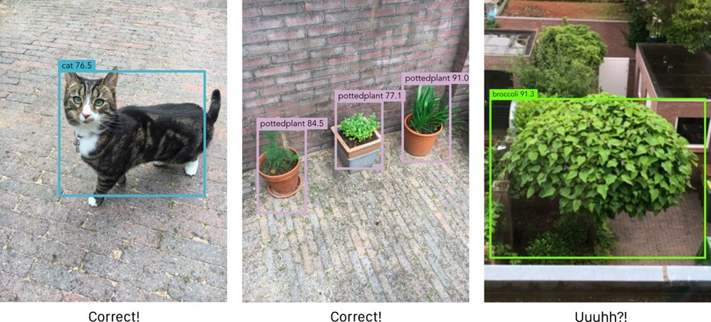
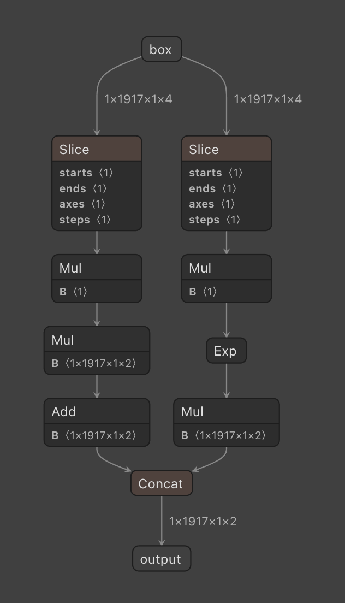
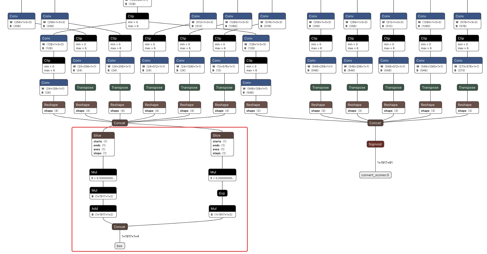
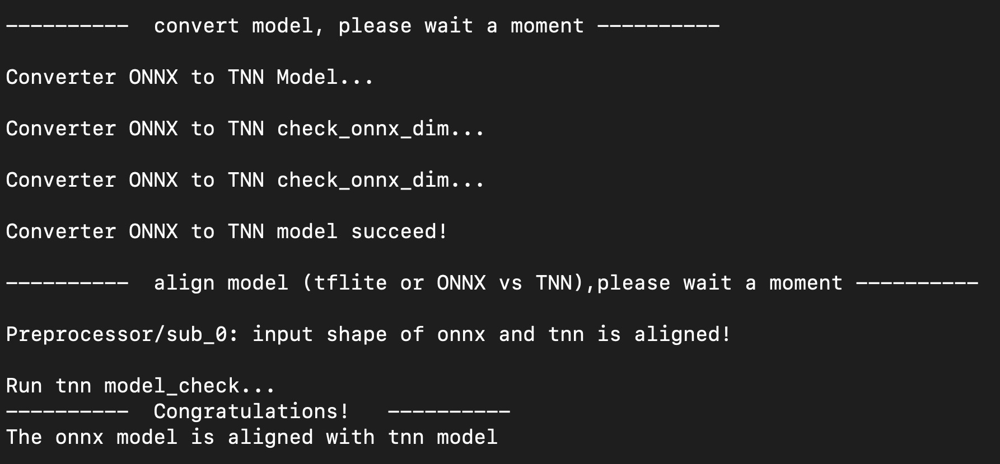

[中文版本](./ssd_conversion_and_deployment.md)

# TNN model conversion and deployment for SSD

## Introduction

SSD is a fast enough object detection algorithm that it can be used for real-time video detection. The SSD algorithm can find the locations of different classes of objects in an image and use bounding boxes to describe the location of the detected objects. For each bounding box, the SSD model predicts the class of the object inside the box.


During deployment, target detection algorithms often require complex and tedious post-processing. This post will describe how to transform and process an SSD TensorFlow model, integrate post-processing into the model, and deploy it with TNN.

## TensorFlow model download and cleaning

There are many different variants of the SSD model, in order to get fast enough, this article will use MobileNet V2 with depthwise separable convolution as the backbone of the algorithm. We use TensorFlow trained ssdlite_mobilenet_v2_coco for conversion, which you can [download here](http://download.tensorflow.org/models/object_detection/ssdlite_mobilenet_v2_coco_2018_05_09.tar.gz).

The downloaded model is trained through the TensorFlow Object Detection API. After downloading and unzipping, the ssdlite_mobilenet_v2_coco model folder contains frozen graph, checkpoint and SavedModel. In the subsequent model conversion process, the required model file is a frozen graph, but it contains operators such as loop, which are not supported in TNN. To avoid problems with subsequent transformations, we need to remove it from the model. First, we load the model,

``` python3
import onnx
import torch
import numpy as np
import tensorflow as tf
from tensorflow.python.tools import strip_unused_lib
from tensorflow.python.framework import dtypes
from tensorflow.python.framework.graph_util import convert_variables_to_constants
from tensorflow.python.platform import gfile

def load_saved_model(path):
    the_graph = tf.Graph()
    with tf.Session(graph=the_graph) as sess:
        tf.saved_model.loader.load(sess, [tf.saved_model.tag_constants.SERVING], path)
    return the_graph

saved_model_path = "ssdlite_mobilenet_v2_coco_2018_05_09/saved_model"

the_graph = load_saved_model(saved_model_path)
```

The loaded model is stored in the_graph as a TensorFlow graph object.

Then we need to use the tool provided by TensorFlow - strip_unused function to perform subgraph segmentation, remove useless subgraphs, and retain the subgraphs we need:

``` python3
input_node = "Preprocessor/sub"
bbox_output_node = "concat"
class_output_node = "Postprocessor/convert_scores"

def optimize_graph(graph):
    gdef = strip_unused_lib.strip_unused(
        input_graph_def=graph.as_graph_def(),
        input_node_names=[input_node],
        output_node_names=[bbox_output_node, class_output_node],
        placeholder_type_enum=dtypes.float32.as_datatype_enum)

    return gdef

opt_gdef = optimize_graph(the_graph)
```

After calling the strip_unused function, the newly obtained graph will only retain the content between the specified input node and output node in the original graph, and the rest of the subgraphs will not be preserved in the new graph.

We get a new graph with one input and two outputs, which are used to predict the coordinates of the bounding box and the class of the object.

If you want to see the structure of the newly obtained graph, you can use the following code to save it in a file named saved_model.pb and visualize it with [Netron](https://github.com/lutzroeder/netron).

``` python3
with gfile.GFile("saved_model.pb", "wb") as f:
    f.write(opt_gdef.SerializeToString())
```

In this part, all the code used is stored [here](../code/part2_clean_tensorflow_model.py).


## Convert TensorFlow model to ONNX model

With the previous modifications, we get the new TensorFlow model. In order to facilitate deployment and convert a new TensorFlow model to a TNN model, we need to first convert the TensorFlow model to an ONNX model, then add bounding box decoding to the ONNX model, and finally convert the ONNX model to a TNN model.

The conversion from TensorFlow model to ONNX model is done with the help of the open source conversion tool tf2onnx. Before starting the conversion, we need to install tf2onnx first,

``` shell
pip3 install tf2onnx
```

Note that the version of tf2onnx needs to be at least 1.5.5 .

After tf2onnx is installed, you can use the following conversion commands to convert TensorFlow models to ONNX models,

``` shell
python3 -m tf2onnx.convert  \
  --graphdef saved_model.pb \
  --inputs "Preprocessor/sub:0[1,300,300,3]" \
  --inputs-as-nchw "Preprocessor/sub:0" \
  --outputs "Postprocessor/convert_scores:0,concat:0" \
  --output saved_model.onnx \
  --opset 11 \
  --fold_const
```

In the above command, use --graphdef to specify the path of the TensorFlow model to be converted; --inputs is used to specify the input name and input shape of the model. The input name can be obtained after visualizing the TensorFlow model through Netron. The following figure is obtained through Netron visualization input information,

<div align=center > 

<div align=left >

In the ssdlite_mobilenet_v2_coco directory, there is the file pipeline.config, from which we can find that the image resolution of the SSD model input is 300x300, so the input shape is [1,300,300,3]. Note that the data layout of the TensorFlow model input is of type NHWC.

In addition, it should be noted that it is often necessary to add a :0 after the input name. For example, the parameters passed in by --inputs of this model can be input:0[1,300,300,3]; --outputs is used to specify the output name, and There is no need to specify the shape of the output, and its acquisition method and precautions are basically the same as --inputs.

For more parameter information, please refer to the official documentation of tf2onnx. The project address of tf2onnx is https://github.com/onnx/tensorflow-onnx .

The shell scripts used in this part are stored [here](../code/part3_convert_tensorflow_to_onnx.sh).

## ONNX model input and output name modification

After transforming the onnx model using tf2onnx, we can already start integrating post-processing operations into the model. However, the input name of the onnx model is Preprocessor/sub:0, and the output name is Postprocessor/convert_scores:0 and concat:0. Such names lack semantic information, which is not easy to understand and is not convenient for subsequent operations. Therefore, we make some modifications to the input and output names, replacing the input name with input and the output name with score and box. Such a name is intuitive and concise, and it is also convenient for subsequent use.

The modification of the input and output names of the model can be divided into two steps. The first step is to traverse all the inputs (or outputs) in the model to modify them. The second step is to traverse all the nodes in the model and modify all the used inputs (or outputs). output) node.

``` python3
onnx_model = onnx.load("saved_model.onnx")

def modify_input_name(model, src_name, dst_name):
    for i in range(len(onnx_model.graph.input)):
        if onnx_model.graph.input[i].name == src_name:
            onnx_model.graph.input[i].name = dst_name
    for i in range(len(onnx_model.graph.node)):
        for j in range(len(onnx_model.graph.node[i].input)):
            if onnx_model.graph.node[i].input[j] == src_name:
                onnx_model.graph.node[i].input[j] = dst_name

    return model

def modify_output_name(model, src_name, dst_name):
    for i in range(len(onnx_model.graph.output)):
        if onnx_model.graph.output[i].name == src_name:
            onnx_model.graph.output[i].name = dst_name
    for i in range(len(onnx_model.graph.node)):
        for j in range(len(onnx_model.graph.node[i].output)):
            if onnx_model.graph.node[i].output[j] == src_name:
                onnx_model.graph.node[i].output[j] = dst_name

    return model

modify_input_name(onnx_model, "Preprocessor/sub:0", "input")
modify_output_name(onnx_model, "Postprocessor/convert_scores:0", "score")
modify_output_name(onnx_model, "concat:0", "box")

onnx.save(onnx_model, "saved_model_modify.onnx")
```

In this way, we get the onnx model with the input and output names modified and save it as saved_model_modify.onnx . Post-processing operations such as boundary decoding can then be added to the model.

The code to modify the input and output names of the model is placed [here](../code/part4_fix_onnx_input_and_output.py).


## Add bounding box decoding to ONNX models

In the SSD model, the final output bounding box is not the real coordinates. In order to better adapt to the variable shape of the target, SSD uses the Anchor box, and the final output of the model is based on the offset of the Anchor box. In other words, the output of the SSD needs to be decoded together with the Anchor box to get the final predicted bounding box coordinates.

The following formula describes how to get the final predicted bounding box from the output of the SSD and the Anchor box,

``` text
x = (tx / 10) * aw + ax
y = (ty / 10) * ah + ay
w = exp(tw / 5) * aw
h = exp(th / 5) * ah
```

where, tx, ty, tw, th are the prediction results of SSD, ax, ay, aw, ah are the anchor box coordinates, and x, y, w, h are the final bounding box coordinates.

Taking the final bounding box coordinates as an example, x, y are used to represent the center coordinates of the box, w, h are used to represent the length and width of the box, and the meanings of the remaining coordinates are similar to those of the bounding box coordinates.

For the Anchor box, in fact, we don't need to care about its specific coordinates, because it is a hyperparameter that has been determined before training and is fixed throughout the process. This article provides a file with the coordinates of the Anchor box. We will use the Anchor box to decode it later. Just click [here](https://drive.weixin.qq.com/s?k=AJEAIQdfAAoVU0puc8) to download.

In the previous part, we have converted the SSD model from TensorFlow to ONNX model. In order to facilitate the use of the model, next, it is necessary to add decoding to the SSD model based on the decoding formula.

In order to add decoding to the SSD model, we use the Python API provided by ONNX to build a bounding box decoding model, and then concatenate the SSD model and the bounding box decoding model to obtain a complete model.

### Building bounding box decoding ONNX models

Analyzing the above formula, it can be found that the following operations are mainly used in the process of bounding box decoding:

+ Slice: The four kinds of bounding box information x, y, w, and h are contained in the same Tensor. Before subsequent decoding, the output Tensor needs to be sliced ​​to obtain different coordinates, which is convenient for subsequent decoding.

+ Multiplication: for bounding box decoding

+ Addition: for bounding box decoding

+ Exponent: for bounding box decoding

+ Concat: used to concatenate the decoded information into a complete Tensor

Next, we use ONNX's Python API to build these five operators,

``` python3
def create_slice_node(name: str, start: list, end: list, axes: list, step: list, input_name: str, output_shape: list):
    param_dict = {"start": start, "end": end, "axes": axes, "step": step}
    inputs_name = [input_name]
    initializer_list = []
    for suffix, param in param_dict.items():
        initializer_name = "{}_{}".format(name, suffix)
        value = np.array(param, dtype=np.int64)
        initializer = helper.make_tensor(initializer_name, onnx.mapping.NP_TYPE_TO_TENSOR_TYPE[value.dtype],
                                         value.shape, value)
        inputs_name.append(initializer_name)
        initializer_list.append(initializer)

    output = helper.make_tensor_value_info(name, TensorProto.FLOAT, output_shape)
    slice_def = helper.make_node(op_type="Slice", inputs=inputs_name, outputs=[name])

    return slice_def, initializer_list, [output, ]

def create_mul_node(name: str, input_name: str, output_shape: list, weights=None):
    initializer_name = "{}_{}".format(name, "weights")
    data_type = weights.dtype if type(weights) is np.ndarray else np.dtype(np.float32)
    shape = weights.shape if type(weights) is np.ndarray else (len(weights),)
    value = list(weights.reshape(-1, )) if type(weights) is np.ndarray else weights
    initializer = helper.make_tensor(initializer_name, onnx.mapping.NP_TYPE_TO_TENSOR_TYPE[data_type], shape, value)
    output = helper.make_tensor_value_info(name, TensorProto.FLOAT, output_shape)
    mul_def = helper.make_node(op_type="Mul", inputs=[input_name, initializer_name], outputs=[name])

    return mul_def, [initializer, ], [output, ]

def create_add_node(name: str, input_name: str, output_shape: list, weights=None):
    initializer_name = "{}_{}".format(name, "weights")
    data_type = weights.dtype if type(weights) is np.ndarray else np.dtype(np.float32)
    shape = weights.shape if type(weights) is np.ndarray else (len(weights),)
    value = list(weights.reshape(-1, )) if type(weights) is np.ndarray else weights
    initializer = helper.make_tensor(initializer_name, onnx.mapping.NP_TYPE_TO_TENSOR_TYPE[data_type], shape, value)
    output = helper.make_tensor_value_info(name, TensorProto.FLOAT, output_shape)
    add_def = helper.make_node(op_type="Add", inputs=[input_name, initializer_name], outputs=[name])

    return add_def, [initializer, ], [output, ]

def create_exp_node(name: str, input_name: str, output_shape: list):
    output = helper.make_tensor_value_info(name, TensorProto.FLOAT, output_shape)
    exp_def = helper.make_node(op_type="Exp", inputs=[input_name, ], outputs=[name])

    return exp_def, [output, ]

def create_concat_node(name: str, axis: int, inputs_name, output_shape: list):
    output = helper.make_tensor_value_info(name, TensorProto.FLOAT, output_shape)
    concat_def = helper.make_node(op_type="Concat", inputs=inputs_name, outputs=[name], axis=axis)

    return concat_def, [output, ]
```

After packaging the construction process of the operator, we can construct the decoding model according to the bounding box decoding formula.

In the SSD model, there are two outputs score and box. The bounding box decoding model decodes the box, so we can use the box as the input of the bounding box decoding model.

``` python3
box = helper.make_tensor_value_info('box', TensorProto.FLOAT, [1, 1917, 1, 4])
```

The above code creates a box variable to describe the input of the bounding box decoding model, the name of this input is box, the type is FLOAT, and the shape is [1, 1917, 1, 4].

Observing the calculations in the formula, it can be found that the decoding operations are divided into two categories, one is y and x, after dividing by 10 and using the corresponding Anchor data for linear transformation, the other is h and w, after dividing by 5 Find the exponent and multiply it by the corresponding Anchor data. Therefore, we do not need to divide the input Tensor into four parts: x, y, h, and w. We only need to use the slice operator to slice the input Tensor and divide it into two parts, yx and hw.

``` python3
slice_yx, slice_yx_ini, slice_yx_output = create_slice_node("slice_yx", [0], [2], [3], [1], box.name, [1, 1917, 1, 2])
slice_hw, slice_hw_ini, slice_hw_output = create_slice_node("slice_hw", [2], [4], [3], [1], box.name, [1, 1917, 1, 2])
```

During the slicing process, we averagely divide the Tensor into two parts in the axis=3 dimension, one for yx and the other for hw. There is a point to pay special attention to here. In the output of the SSD model box, the data is arranged in the order of y, x, h, w, so the first data is yx instead of xy.

Next, we first decode yx. Because division is more time-consuming in the process of reasoning, we replace it with multiplication equivalently,

``` python3
yx_mul_const, yx_mul_const_ini, yx_mul_const_output = create_mul_node("yx_mul_const", "slice_yx", [1, 1917, 1, 2],  [0.1])
```

After completing the division calculation, we need to use the Anchor data to perform a linear transformation. In the previous part, we have downloaded the Anchor data, now we read it into memory,

``` python3
anchor_yx = np.load("anchor_data/anchor_yx.npy")
anchor_hw = np.load("anchor_data/anchor_hw.npy")
```

The shape of the Anchor data saved in the npy file is [2, 1917, 1], which does not match the dimension of the decoded data. We use numpy's transpose and expand_dims to transform the Anchor data to make it [1, 1917, 1, 2], matching the decoded data,

``` python3
anchor_yx = np.expand_dims(anchor_yx.transpose((1, 2, 0)), axis=0)
anchor_hw = np.expand_dims(anchor_hw.transpose((1, 2, 0)), axis=0)
```

With the Anchor data, we can perform linear transformations according to the formula,

``` python3
yx_mul_anchor_hw, yx_mul_anchor_hw_ini, yx_mul_anchor_hw_output = create_mul_node("yx_mul_anchor_hw", "yx_mul_const", [1, 1917, 1, 2], anchor_hw)
yx_add_anchor_yx, yx_add_anchor_yx_ini, yx_add_anchor_yx_output = create_add_node("yx_add_anchor_yx", "yx_mul_anchor_hw", [1, 1917, 1, 2], anchor_yx)
```

This completes the decoding of the yx part, and then the decoding of the hw part. In this section, we also use multiplication as an equivalent replacement for multiplication,

``` python3
hw_mul_const, hw_mul_const_ini, hw_mul_const_output = create_mul_node("hw_mul_const", "slice_hw", [1, 1917, 1, 2], [0.2])
```

Next, calculate the index according to the formula,

``` python3
hw_exp, hw_exp_output = create_exp_node("hw_exp", "hw_mul_const", [1, 1917, 1, 2])
```

Finally multiply the Anchor data,

``` python3
hw_mul_anchor_hw, hw_mul_anchor_hw_ini, hw_mul_anchor_hw_output = create_mul_node("hw_mul_anchor_hw", "hw_exp", [1, 1917, 1, 2], anchor_hw)
```

Through the above steps, we have completed the decoding of yx and hw, and we have obtained two different Tensors. For the convenience of subsequent use, we use the concat operator to splicing yx and hw together,

``` python3
concat, concat_output = create_concat_node("output", -1, ["yx_add_anchor_yx", "hw_mul_anchor_hw"], [1, 1917, 1, 2])
```

The above operations just convert the decoding process into specific ONNX operators. To build a complete ONNX model, we need to use these operators to build a graph, and then use this graph to build an ONNX model.

To build a graph using the make_graph method, we need to pass in all the operators, the input and output of the graph, and the initializer for each operator,

``` python3
graph_def = helper.make_graph(
    [slice_yx, yx_mul_const, yx_mul_anchor_hw, yx_add_anchor_yx, slice_hw, hw_mul_const, hw_exp, hw_mul_anchor_hw,
     concat],  # nodes
    'test-model',  # name
    [box],  # inputs
    concat_output,  # outputs
    initializer=slice_yx_ini + yx_mul_const_ini + yx_mul_anchor_hw_ini + yx_add_anchor_yx_ini + slice_hw_ini + hw_mul_const_ini + hw_mul_anchor_hw_ini
)
```

After the graph is built, you can start building the ONNX model.

``` python3
model_def = helper.make_model(graph_def, producer_name='onnx-example')
model_def.ir_version = 6
imp = model_def.opset_import[0]
imp.version = 11
```

Note that the ir_verson and opset_version of the ONNX model need to be consistent with the SSD model, otherwise we will not be able to stitch the two models together.

To confirm that the ONNX model is correct, we can verify it like this,

``` python3
onnx.checker.check_model(model_def)
print('The model is checked!')
```

In this way, we have completed the construction of the bounding box decoding model, and we can save it,

``` python3
onnx.save(model_def, "decoder.onnx")
```

If we want to see the structure of the model, we can use Netron to visualize it,

<div align=center > 

<div align=left >

### Concat SSD model and bounding box decoding model

After getting the decoding model, the next thing we need to do is to merge the two models together. We first load the SSD model and decoding model,

``` python3
ssd_model = onnx.load("saved_model_modify.onnx")
decode_model = onnx.load("decoder.onnx")
```

Then, use the Python API provided by ONNX -- merge_models to splicing the two models,

``` python3
combined_model = onnx.compose.merge_models(ssd_model, decode_model, io_map=[("box", "box"), ])
```

In this way, the model after stitching is obtained. It should be noted that the corresponding ir_version and opset_version of the two spliced models need to be consistent.

In order to facilitate subsequent use, we need to save the merged model,

``` python3
onnx.save(combined_model, './new_model.onnx')
```

We visualize the new model with Netron to confirm that we have successfully merged the two models together,

<div align=center > 

<div align=left >

After visualization, we can see that the decoding operation has been successfully added to the SSD model, and then we can start to convert the TNN model.

In this part, all the code used is placed [here](../code/part5_add_decoding_in_onnx.py).


## ONNX model to TNN model

After getting the ONNX model, we can convert the ONNX model to a TNN model. TNN provides two ways to convert models, one is to convert locally compiled model conversion tools, and the other is to use the docker image provided by TNN for conversion.

If you want to compile the TNN model conversion tool locally, you can refer to [document](https://github.com/Tencent/TNN/blob/master/doc/cn/user/convert.md#convert2tnn-%E6%89%8B%E5%8A%A8%E5%AE%89%E8%A3%85), if you want to use docker image, you can refer to [document](https://github.com/Tencent/TNN/blob/master/doc/cn/user/convert.md#convert2tnn-docker-%E6%8E%A8%E8%8D%90) .

This article will take the locally compiled TNN model conversion tool as an example to convert the model. The conversion commands of the docker image are roughly the same. If you want to use the docker image for conversion, you can refer to the documentation.

After compiling the TNN model conversion tool locally, first enter the model conversion tool directory,

``` shell
cd <tnn-root>/tools/convert2tnn
```

Then execute the following command to convert the model,

``` shell
python3 converter.py onnx2tnn new_model.onnx -align
```

In the above command, converter.py is the conversion tool script; onnx2tnn is the model conversion mode, which is used to specify that this conversion is to convert the ONNX model to the TNN model; after specifying the conversion model, you need to specify the path of the model to be converted; the last -align is used to let the model conversion tool verify whether the converted TNN model is correct.

The figure below is a screenshot of the log after the model is successfully converted. If you get the same log during conversion, it means that you have successfully completed the conversion of the TNN model.



The script for TNN model conversion is stored [here](../code/part6_convert_to_tnn.sh).


## Running SSD in TNN

After the above series of operations, we get the TNN model with bounding box decoding. Once we have the model, we can use TNN for model inference. In this section, I will describe how to run a TNN model on a MacBook Pro based on the TNN example and show the final result.

First, we pull the TNN repository to the local,

``` shell
git clone https://github.com/Tencent/TNN.git
```

Next, we need to implement our SSD inference code based on the TNN example in the TNN code. The implementation process is mainly divided into two steps. The first step is to implement the SSD model inference logic, which mainly includes input data preprocessing, model inference and output data post-processing (the post-processing logic is mainly bounding box decoding and NMS, in the previous part. We have integrated bounding box decoding into the TNN model, and the operation of NMS has been implemented in TNN, so in the data post-processing step, we only need to convert the inference output into the data structure required by TNN NMS) ; The second step is to implement the calling logic of the SSD model, which mainly includes reading the input image, processing the input image and passing it to the code implemented in the first step for model inference, and then obtaining the inference structure for visualization.

After clarifying the ideas, let's first implement the reasoning logic of the SSD model. In the implementation of this part of the code, two operations are mainly done, one is to set the preprocessing parameters of the model, and the other is to process the output data of the model into the data structure ObjectInfo required by TNN NMS.

The setting of the model's preprocessing parameters is done in GetConvertParamForInput. We set the model preprocessing parameter scale to 2 / 255.0 and bias to -1.0,

``` c++
MatConvertParam ObjectDetectorSSD::GetConvertParamForInput(std::string tag) {
    MatConvertParam input_convert_param;
    input_convert_param.scale = {2.0 / 255, 2.0 / 255, 2.0 / 255, 0.0};
    input_convert_param.bias  = {-1, -1, -1, 0.0};
    return input_convert_param;
}
```

The post-processing of the output data is mainly done in ProcessSDKOutput. Take out the two output score and box of the model, call GenerateObjects to process, and use NMS to output the data, thus completing the whole post-processing process,

``` c++
Status ObjectDetectorSSD::ProcessSDKOutput(std::shared_ptr<TNNSDKOutput> output_) {
    Status status          = TNN_OK;
    auto output            = dynamic_cast<ObjectDetectorSSDOutput *>(output_.get());
    auto output_mat_scores = output->GetMat("score");
    auto output_mat_boxes  = output->GetMat("output");
    auto input_shape       = GetInputShape();
    std::vector<ObjectInfo> object_list;
    GenerateObjects(object_list, output_mat_scores, output_mat_boxes, 0.75, input_shape[3], input_shape[2]);
    std::vector<ObjectInfo> object_list_nms;
    TNN_NS::NMS(object_list, object_list_nms, 0.25, TNNHardNMS);
    output->object_list = object_list_nms;
    return status;
}
```

GenerateObjects needs to be implemented by ourselves. Its function is to initially filter the output bounding box and convert the inference output of TNN into the data structure required by TNN NMS. In GenerateObjects, traverse all the boxes obtained by the model inference, filter out the score greater than the threshold, restore the coordinates of the boxes according to the length and width of the original image, and put them into the variable objects of type ObjectInfo,

``` c++
void ObjectDetectorSSD::GenerateObjects(std::vector<ObjectInfo> &objects, std::shared_ptr<Mat> scores,
                                           std::shared_ptr<Mat> boxes, float score_threshold, int image_width,
                                           int image_height) {
    int num_anchors   = scores->GetDim(1);
    int num_class     = scores->GetDim(2);
    auto *scores_data = (float *)scores->GetData();
    auto *boxes_data  = (float *)boxes->GetData();
    auto clip         = [](float v) { return (std::min)(v > 0.0 ? v : 0.0, 1.0); };

    for (int i = 0; i < num_anchors; i++) {
        int target_class_id      = 0;
        float target_class_score = -1;
        for (int class_id = 0; class_id < num_class; class_id++) {
            int index = i * num_class + class_id;
            if (scores_data[index] > target_class_score) {
                target_class_id    = class_id;
                target_class_score = scores_data[index];
            }
        }

        if (target_class_score <= score_threshold || target_class_id == 0) {
            continue;
        }

        float y_c = boxes_data[i * 4 + 0];
        float x_c = boxes_data[i * 4 + 1];
        float th  = boxes_data[i * 4 + 2];
        float tw  = boxes_data[i * 4 + 3];

        ObjectInfo info;
        info.image_width  = image_width;
        info.image_height = image_height;
        info.class_id     = target_class_id;
        info.score        = target_class_score;

        info.x1 = clip(x_c - tw / 2.0) * image_width;
        info.y1 = clip(y_c - th / 2.0) * image_height;
        info.x2 = clip(x_c + tw / 2.0) * image_width;
        info.y2 = clip(y_c + th / 2.0) * image_height;

        objects.push_back(info);
    }
}
```

In this way, we have completed the implementation of model inference, and now we are only short of the last step - to implement the calling logic, we can run our SSD model in TNN.

Before calling the inference code we just implemented, we need to prepare the input data required for inference, that is, read the image to be detected and resize it to the input size 300x300 required by the SSD model.

``` c++
char input_path_buff[256];
char * input_path_ptr = input_path_buff;
strncpy(input_path_ptr, FLAGS_i.c_str(), 256);
int image_width, image_height, image_channel;
unsigned char *data   = stbi_load(input_path_ptr, &image_width, &image_height, &image_channel, 3);
std::vector<int> nchw = {1, 3, image_height, image_width};
auto image_mat = std::make_shared<TNN_NS::Mat>(TNN_NS::DEVICE_NAIVE, TNN_NS::N8UC3, nchw, data);

TNN_NS::DimsVector resize_dims = {1, 3, 300, 300};
auto resize_mat = std::make_shared<TNN_NS::Mat>(TNN_NS::DEVICE_NAIVE, TNN_NS::N8UC3, resize_dims);
auto resize_mat = std::make_shared<TNN_NS::Mat>(TNN_NS::DEVICE_NAIVE, TNN_NS::N8UC3, resize_dims);
TNN_NS::MatUtils::Resize(*image_mat, *resize_mat, TNN_NS::ResizeParam(), NULL);
```

Next, we create an inference instance of the SSD model and initialize it,

``` c++
auto predictor = std::make_shared<TNN_NS::ObjectDetectorSSD>();
auto status    = predictor->Init(option);
```

Then, we pass in the input data for inference,

``` c++
predictor->Predict(std::make_shared<TNN_NS::TNNSDKInput>(resize_mat), sdk_output)；
```

The data output by inference is stored in sdk_output, which contains the coordinates of the prediction box. We take it out and draw a bounding box on the image to complete.

After the code is implemented, we can compile and run it. How to compile the code in the TNN example section, we can refer to TNN's [documentation](https://github.com/Tencent/TNN/blob/master/doc/cn/user/demo.md#macos).

I selected a picture containing cats and dogs from the Internet for reasoning to verify the reasoning effect of the SSD model. The following picture is the result of the detection.


As you can see, both cats and dogs in the picture are detected, so our SSD model runs successfully in TNN.

Due to space limitations, the complete code is not shown in this section, only the main part is shown. If you want to see the full code, for more details, it can be found in the [TNN example](../../../examples/base/object_detector_ssd.cc) section.


## Summarize

By adding the decoding process to the TensorFlow model and model transformation, we end up with a TNN model. The advantage of integrating decoding into the model is that it is more convenient to use than directly converting the TNN model and adding decoding operations in post-processing. Integrating decoding into the model allows us to deploy on a variety of different platforms.


## References

+ https://machinethink.net/blog/mobilenet-ssdlite-coreml/
+ https://github.com/Tencent/TNN
+ https://github.com/onnx/tensorflow-onnx


